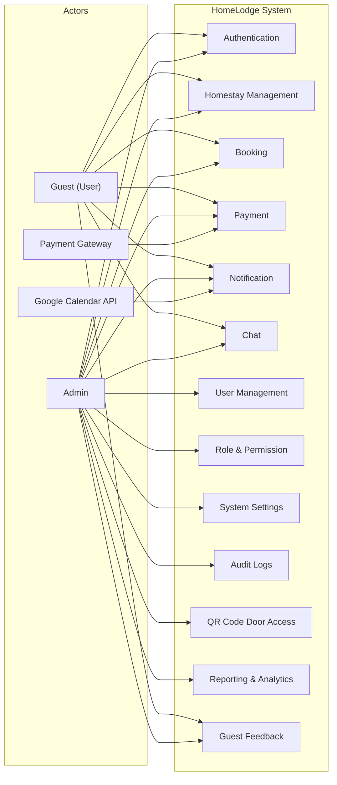
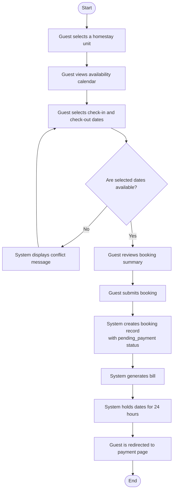
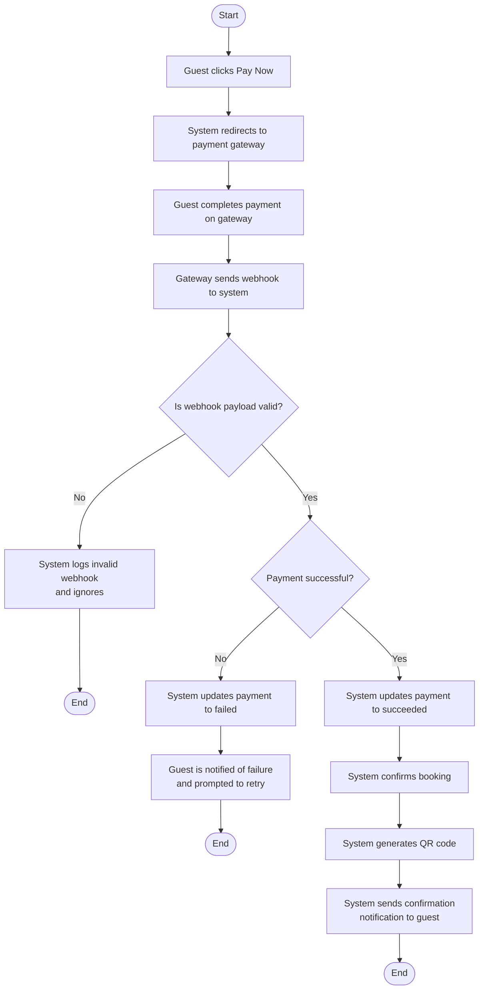
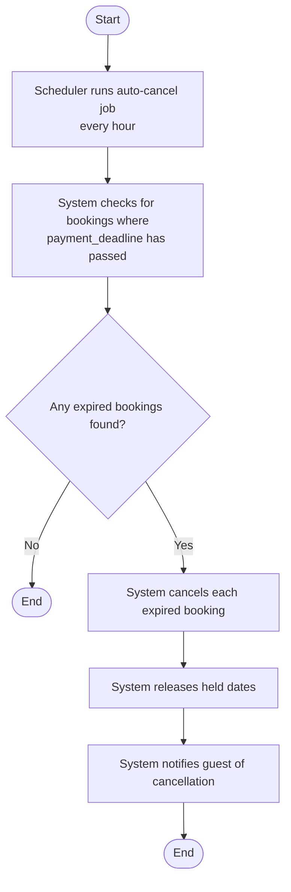
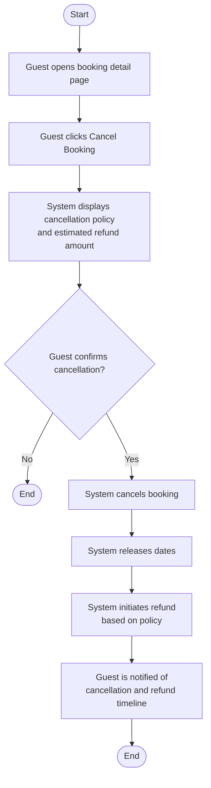
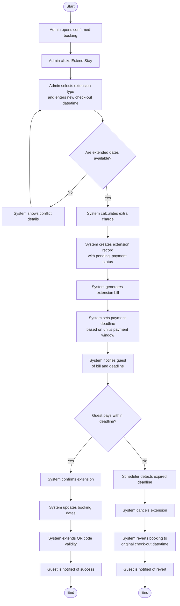
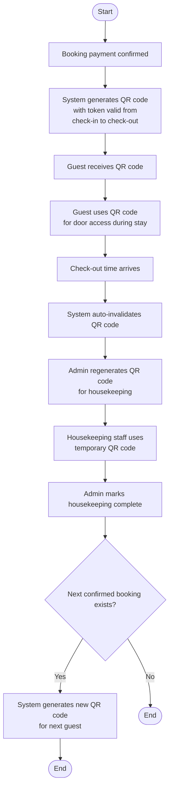
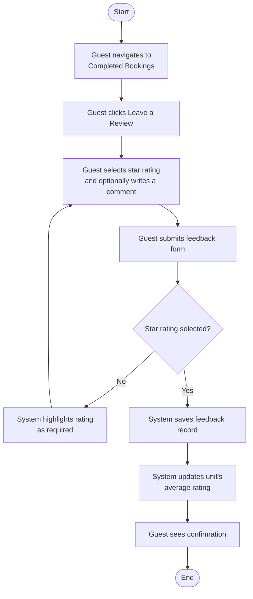
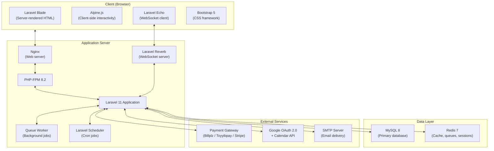
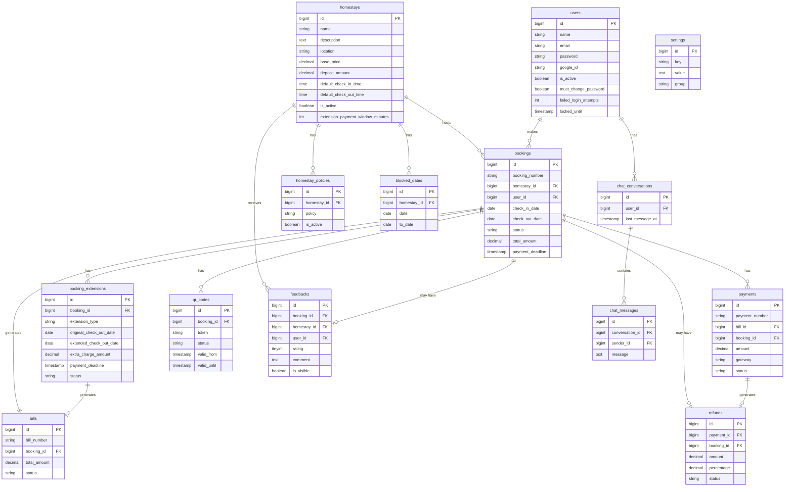

# CHAPTER 4: ANALYSIS AND DESIGN

## 4.1 Introduction

This chapter documents the results of the requirements analysis and system design phases described in Chapter 3. Section 4.2 presents the requirements analysis output: actor definitions, use case summaries for all thirteen modules, and activity diagrams for the primary workflows. Section 4.3 presents the system design output: the system architecture, database schema, and user interface design. All analysis and design work was completed before implementation began.

---

## 4.2 Requirements Analysis Phase Workflow

Requirements analysis is a phase of the System Development Life Cycle (SDLC) in which user expectations are identified and documented. The requirements are studied, analysed, and described so that the final system addresses the problems users face. In this project, two types of UML diagram are used to define the system's scope and to show how one activity leads to the next: use case diagrams and activity diagrams.

This section presents the output of Phase 1 (Requirements Analysis) of the hybrid methodology described in Chapter 3. All functional requirements for HomeLodge were gathered, documented, and finalised before any design or implementation work began. The analysis produced a complete use case model with four actors and sixty-seven use cases across thirteen modules. The subsections below describe each actor, summarise every use case, and provide activity diagrams for the primary workflows.

### 4.2.1 Use Case Modelling

The use case model for HomeLodge was derived from the User Requirements Specification (URS) and the Product Requirements Document (PRD). The system has four actors and thirteen modules, producing a total of sixty-seven use cases. Figure 4.1 shows the system-level use case diagram.

Figure 4.1: System-Level Use Case Diagram



#### 4.2.1.1 Actor Descriptions

Table 4.1 describes each actor that interacts with the HomeLodge system.

Table 4.1: Actor Descriptions

| Actor | Type | Description |
|---|---|---|
| Guest (User) | Human | A traveller or local who registers an account, browses homestay units, makes bookings, pays online, receives QR codes for door access, communicates with the admin through chat, and submits feedback after a completed stay. The guest can also view their booking history and payment records. |
| Admin | Human | The property owner or manager who oversees all operations. The admin manages homestay units, processes bookings, initiates booking extensions, controls user accounts and roles, configures system settings, generates reports, moderates guest feedback, and communicates with guests through chat. |
| Payment Gateway | External system | A third-party payment processor (Billplz, Toyyibpay, or Stripe) that processes online payments and sends webhook callbacks to HomeLodge when a payment event occurs. The system verifies the webhook payload before updating booking and payment records. |
| Google Calendar API | External system | The Google Calendar service that receives calendar event data from HomeLodge when a booking is confirmed. Confirmed bookings appear as events in the Google Calendar of both the guest and the admin. |

#### 4.2.1.2 Use Case Descriptions

This section summarises the use cases for each module. The full use case descriptions, including preconditions, postconditions, main flows, and alternative flows, are documented in the Use Case Descriptions reference document.

**Authentication Module**

The Authentication module has ten use cases. Table 4.2 summarises them.

Table 4.2: Authentication Module Use Cases

| Use Case ID | Use Case Name | Actor(s) | Description |
|---|---|---|---|
| UC-AUTH-01 | Register Account (Email/Password) | Guest | A new user registers with an email address and password. The system validates inputs, creates the account with the Guest role, and sends a verification email. |
| UC-AUTH-02 | Register / Login via Google SSO | Guest, Admin | The user authenticates through Google OAuth 2.0. If no account exists, one is created automatically. |
| UC-AUTH-03 | Login | Guest, Admin | A registered user logs in with email and password. The system validates credentials and records the login timestamp. |
| UC-AUTH-04 | Logout | Guest, Admin | The user ends their session. The session token is invalidated and the user is redirected to the login page. |
| UC-AUTH-05 | Forgot Password | Guest, Admin | The user requests a password reset link sent to their registered email. A time-limited token is generated. If the account was locked, the lockout is lifted upon successful reset. |
| UC-AUTH-06 | View / Update Profile | Guest, Admin | The user views and edits their profile information (name, phone number, profile photo). |
| UC-AUTH-07 | Show/Hide Password Toggle | Guest | The user toggles password field visibility on login, registration, or password change forms. |
| UC-AUTH-08 | Force Change Password | Guest | After an admin resets a user's password, the user must set a new password on next login before accessing any other page. |
| UC-AUTH-09 | Account Lockout | System | The system locks an account after the configured number of consecutive failed login attempts is exceeded. |
| UC-AUTH-10 | Auto Unlock Account | System | The system unlocks a locked account after the configured lockout duration passes, or immediately upon a successful password reset. |

**Homestay Management Module**

The Homestay Management module has eleven use cases. Table 4.3 summarises them.

Table 4.3: Homestay Management Module Use Cases

| Use Case ID | Use Case Name | Actor(s) | Description |
|---|---|---|---|
| UC-HS-01 | Browse Homestay Units | Guest | The guest views a list of all active homestay units available for booking, showing unit names, thumbnails, base price, and location. |
| UC-HS-02 | View Unit Details & Availability | Guest | The guest views full details of a unit, including description, images, pricing, check-in/out times, and a real-time availability calendar. |
| UC-HS-03 | View House Policies | Guest | The guest views the house rules for a unit before booking (e.g., no smoking, no pets). |
| UC-HS-04 | Create Homestay Unit | Admin | The admin creates a new unit with name, description, location, pricing, images, and check-in/out times. Default policies are automatically copied to the new unit. |
| UC-HS-05 | Edit Homestay Unit | Admin | The admin updates the details of an existing unit. |
| UC-HS-06 | Deactivate / Delete Unit | Admin | The admin deactivates or soft-deletes a unit. Units with confirmed future bookings cannot be deleted. |
| UC-HS-07 | Upload Unit Images | Admin | The admin uploads one or more images for a unit during creation or editing. |
| UC-HS-08 | Set Pricing & Check-in/out Times | Admin | The admin configures base price, deposit amount, and default check-in/out times for a unit. |
| UC-HS-09 | Manage Unit House Policies | Admin | The admin adds, edits, or removes house policies for a specific unit. |
| UC-HS-10 | Apply Default Policies (On Unit Creation) | System | When a new unit is created, the system copies all active system-level default policies to the unit's policy list. |
| UC-HS-11 | View All Units List | Admin | The admin views a list of all units with their status (active/inactive) and upcoming booking summaries. |

**Booking Module**

The Booking module has twelve use cases. Table 4.4 summarises them.

Table 4.4: Booking Module Use Cases

| Use Case ID | Use Case Name | Actor(s) | Description |
|---|---|---|---|
| UC-BK-01 | View Availability Calendar | Guest | The guest views a monthly availability calendar for a unit before selecting dates. |
| UC-BK-02 | Select Check-in / Check-out Date & Time | Guest | The guest selects dates and times from the calendar. The system checks availability in real time. |
| UC-BK-03 | Check Date Availability (Real-time) | System | The system verifies that no confirmed, pending, or blocked dates conflict with the guest's selection. |
| UC-BK-04 | Submit Booking | Guest | The guest confirms and submits a booking. The system creates the booking record, generates a bill, and temporarily holds the dates. |
| UC-BK-05 | Temporary Hold (Payment Window) | System | After submission, the system holds the selected dates for 24 hours to allow the guest to complete payment. |
| UC-BK-06 | Auto-Cancel Booking (Payment Timeout) | System | If payment is not received within 24 hours, the system cancels the booking and releases the held dates. |
| UC-BK-07 | View Current Bookings | Guest | The guest views all active (confirmed or pending) bookings. |
| UC-BK-08 | View Booking History | Guest | The guest views past (completed or cancelled) bookings. |
| UC-BK-09 | Cancel Booking | Guest | The guest cancels a booking. The system displays the cancellation policy and estimated refund before confirmation. |
| UC-BK-10 | Block Dates | Admin | The admin blocks specific dates on a unit to prevent bookings (e.g., for maintenance). |
| UC-BK-11 | Create Booking (On Behalf of User) | Admin | The admin creates a booking for a selected registered user. |
| UC-BK-12 | Edit / Delete / Cancel Booking | Admin | The admin can edit, delete, or cancel any booking. |

**Payment Module**

The Payment module has five use cases. Table 4.5 summarises them.

Table 4.5: Payment Module Use Cases

| Use Case ID | Use Case Name | Actor(s) | Description |
|---|---|---|---|
| UC-PAY-01 | Make Payment (Online Gateway) | Guest, Payment Gateway | The guest is redirected to the payment gateway. After payment, the gateway sends a webhook to the system, which verifies and updates the records. |
| UC-PAY-02 | View Payment Bill | Guest | The guest views the bill generated for their booking, showing itemised charges. |
| UC-PAY-03 | View / Download Receipt | Guest | The guest views or downloads a PDF receipt after successful payment. |
| UC-PAY-04 | Process Payment Webhook | Payment Gateway, System | The gateway sends an HTTP callback to the system. The system verifies the payload signature and updates payment, booking, and billing records accordingly. |
| UC-PAY-05 | Regenerate Bill / Receipt | Admin | The admin regenerates a bill or receipt PDF on demand. |

**Notification Module**

The Notification module has four use cases. Table 4.6 summarises them.

Table 4.6: Notification Module Use Cases

| Use Case ID | Use Case Name | Actor(s) | Description |
|---|---|---|---|
| UC-NOTIF-01 | Receive In-App Notification | Guest, Admin | The user receives a real-time in-app notification (bell icon with badge) for system events such as booking confirmation, payment received, and extension updates. |
| UC-NOTIF-02 | Receive Email Notification | Guest, Admin | The system sends email notifications for booking confirmation, payment receipt, cancellation, and extension billing. |
| UC-NOTIF-03 | Receive Payment Reminder | Guest | The system sends reminders to guests with pending payments to complete payment before the deadline. |
| UC-NOTIF-04 | View Booking in Google Calendar | Guest, Admin | Confirmed bookings are synchronised to the user's Google Calendar as calendar events. |

**Chat Module**

The Chat module has three use cases. Table 4.7 summarises them.

Table 4.7: Chat Module Use Cases

| Use Case ID | Use Case Name | Actor(s) | Description |
|---|---|---|---|
| UC-CHAT-01 | Send Message | Guest, Admin | The user sends a text message to the other party via the built-in chat. The message is delivered in real time through WebSocket. |
| UC-CHAT-02 | Receive Message (Real-time) | Guest, Admin | The user receives a message instantly without refreshing the page. A typing indicator is shown while the other party composes. |
| UC-CHAT-03 | View Chat History | Guest, Admin | The user views the full conversation history in chronological order. |

**User Management Module**

The User Management module has four use cases. Table 4.8 summarises them.

Table 4.8: User Management Module Use Cases

| Use Case ID | Use Case Name | Actor(s) | Description |
|---|---|---|---|
| UC-USR-01 | Create User Account | Admin | The admin manually creates a user account and assigns a role. The user is notified with a temporary password and must change it on first login. |
| UC-USR-02 | Edit User Account | Admin | The admin updates a user's name, email, or role assignment. |
| UC-USR-03 | Activate / Deactivate User | Admin | The admin toggles a user's active status. Deactivated users cannot log in. |
| UC-USR-04 | Reset User Password | Admin | The admin resets a user's password to the default (`Abc@123`) and forces a password change on next login. |

**Role and Permission Module**

The Role and Permission module has three use cases. Table 4.9 summarises them.

Table 4.9: Role and Permission Module Use Cases

| Use Case ID | Use Case Name | Actor(s) | Description |
|---|---|---|---|
| UC-ROLE-01 | Create / Edit / Delete Role | Admin | The admin manages roles. A role assigned to one or more users cannot be deleted. |
| UC-ROLE-02 | Assign Permissions to Role | Admin | The admin assigns or revokes permissions for a role. Changes take effect immediately for all users with that role. |
| UC-ROLE-03 | Create / Edit / Delete Permission | Admin | The admin manages permission keys (e.g., `bookings.cancel`). A permission attached to a role cannot be deleted. |

**System Settings Module**

The System Settings module has six use cases. Table 4.10 summarises them.

Table 4.10: System Settings Module Use Cases

| Use Case ID | Use Case Name | Actor(s) | Description |
|---|---|---|---|
| UC-SET-01 | Configure SMTP Settings | Admin | The admin configures outgoing email server credentials (host, port, username, password, encryption). |
| UC-SET-02 | Configure Security Settings | Admin | The admin sets lockout duration, session timeout, and maximum failed login attempts. Values are applied dynamically. |
| UC-SET-03 | Configure Refund Policy Parameters | Admin | The admin sets refund percentage thresholds for cancellations at different time windows. |
| UC-SET-04 | Configure Extension Charge Rates | Admin | The admin sets the extra charge per hour (time extension) and per additional night (date extension). |
| UC-SET-05 | Configure Extension Payment Window | Admin | The admin sets the system-wide default number of minutes a guest has to pay an extension charge. Default is 60 minutes. |
| UC-SET-06 | Manage Default Homestay Policies | Admin | The admin manages the default policies applied to every new homestay unit upon creation. |

**Audit Logs Module**

The Audit Logs module has three use cases. Table 4.11 summarises them.

Table 4.11: Audit Logs Module Use Cases

| Use Case ID | Use Case Name | Actor(s) | Description |
|---|---|---|---|
| UC-AUDIT-01 | View Audit Trail | Admin | The admin views a chronological log of all user actions, admin changes, authentication events, and system events. |
| UC-AUDIT-02 | Filter Audit Logs | Admin | The admin filters the audit log by date range, event type, or actor. |
| UC-AUDIT-03 | Automatic Event Logging | System | The system automatically logs all loggable events. Logs are read-only and cannot be modified or deleted. |

**QR Code Door Access Module**

The QR Code Door Access module has thirteen use cases. Table 4.12 summarises them.

Table 4.12: QR Code Door Access Module Use Cases

| Use Case ID | Use Case Name | Actor(s) | Description |
|---|---|---|---|
| UC-QR-01 | Receive QR Code | Guest | After booking confirmation, the system generates a unique QR code and delivers it to the guest via in-app notification and email. |
| UC-QR-02 | Use QR Code for Door Access | Guest | The guest presents the QR code at the door during the valid period (check-in to check-out). |
| UC-QR-03 | Auto-Invalidate QR Code | System | The system invalidates the guest's QR code when the check-out time passes. |
| UC-QR-04 | Regenerate QR Code (Housekeeping) | Admin | The admin generates a temporary QR code for housekeeping staff to access the property between bookings. |
| UC-QR-05 | Auto-Generate QR Code (Next Guest) | System | After housekeeping is marked complete, the system generates a new QR code for the next confirmed booking. |
| UC-QR-06 | Initiate Booking Extension | Admin | The admin initiates an extension (time or date), the system checks availability, calculates the charge, creates an extension record, and notifies the guest to pay. |
| UC-QR-07 | Generate Extension Bill & Set Deadline | System | The system calculates the extra charge and generates a bill. The payment deadline is based on the unit's extension payment window. |
| UC-QR-08 | Notify Guest of Extension Bill | System | The system sends an in-app and email notification with the extension charge and payment deadline. |
| UC-QR-09 | Guest Pays Extension Charge | Guest | The guest pays the additional charge via the payment gateway within the configured window. |
| UC-QR-10 | Confirm Extension (Update Booking + QR) | System | After extension payment is confirmed, the system updates the booking dates and extends the QR code validity. |
| UC-QR-11 | Auto-Cancel Extension | System | A scheduled job cancels extension records whose payment deadline has passed without payment. |
| UC-QR-12 | Revert Booking to Original Dates | System | When an extension is cancelled, the system reverts the booking to the original check-out date and time. |
| UC-QR-13 | Configure Per-Unit Extension Payment Window | Admin | The admin sets a custom extension payment window for a specific unit, overriding the system-wide default. |

**Reporting and Analytics Module**

The Reporting and Analytics module has six use cases. Table 4.13 summarises them.

Table 4.13: Reporting and Analytics Module Use Cases

| Use Case ID | Use Case Name | Actor(s) | Description |
|---|---|---|---|
| UC-RPT-01 | View Analytics Dashboard | Admin | The admin views summary statistics: total bookings, revenue, occupancy rate, cancellation rate, and guest feedback ratings. |
| UC-RPT-02 | View Booking Trends Chart | Admin | The admin views a line chart of booking volume over time, with daily, weekly, and monthly granularity. |
| UC-RPT-03 | View Revenue Report | Admin | The admin views a revenue report filtered by date range, unit, and payment status. |
| UC-RPT-04 | View Per-Unit Booking Breakdown | Admin | The admin views booking totals segmented by unit. |
| UC-RPT-05 | View Feedback & Rating Summary | Admin | The admin views aggregated guest ratings per unit (average score, total reviews, distribution). |
| UC-RPT-06 | Export Report (PDF / CSV) | Admin | The admin exports any report view as a downloadable PDF or CSV file. |

**Guest Feedback Module**

The Guest Feedback module has six use cases. Table 4.14 summarises them.

Table 4.14: Guest Feedback Module Use Cases

| Use Case ID | Use Case Name | Actor(s) | Description |
|---|---|---|---|
| UC-FB-01 | Submit Rating & Feedback | Guest | After a completed stay, the guest submits a star rating (1-5) and an optional written comment. One feedback per completed booking. |
| UC-FB-02 | View Submitted Feedback | Guest | The guest views all feedback they have previously submitted, including any admin reply. |
| UC-FB-03 | View All Unit Feedback | Admin | The admin views all feedback and ratings for a specific unit or across all units. |
| UC-FB-04 | Respond to Feedback | Admin | The admin writes and publishes a reply to a guest's review. The reply appears alongside the original feedback. |
| UC-FB-05 | Moderate / Hide Feedback | Admin | The admin hides a feedback entry that violates content policies. Hidden feedback is retained in the database but removed from the public listing. Average rating is recalculated. |
| UC-FB-06 | Display Average Rating | System | The system calculates and displays the average star rating on each unit's listing page, based only on visible feedback records. |

### 4.2.2 Activity Diagrams

This section presents activity diagrams for the primary workflows in HomeLodge. Each diagram traces the sequence of actions from start to end, including decision points and alternative paths.

#### 4.2.2.1 Guest Booking Flow

Figure 4.2 shows the activity flow when a guest creates a booking.

Figure 4.2: Activity Diagram — Guest Booking Flow



#### 4.2.2.2 Payment Flow

Figure 4.3 shows the activity flow when a guest makes a payment.

Figure 4.3: Activity Diagram — Payment Flow



#### 4.2.2.3 Auto-Cancellation Flow

Figure 4.4 shows the activity flow when a booking is auto-cancelled due to payment timeout.

Figure 4.4: Activity Diagram — Auto-Cancellation Flow



#### 4.2.2.4 Guest Cancellation Flow

Figure 4.5 shows the activity flow when a guest cancels a booking.

Figure 4.5: Activity Diagram — Guest Cancellation Flow



#### 4.2.2.5 Booking Extension Flow

Figure 4.6 shows the activity flow for a booking extension, from initiation by the admin through to payment or auto-cancellation.

Figure 4.6: Activity Diagram — Booking Extension Flow



#### 4.2.2.6 QR Code Lifecycle Flow

Figure 4.7 shows the activity flow of a QR code from generation through to the housekeeping cycle.

Figure 4.7: Activity Diagram — QR Code Lifecycle



#### 4.2.2.7 Guest Feedback Submission Flow

Figure 4.8 shows the activity flow when a guest submits feedback.

Figure 4.8: Activity Diagram — Guest Feedback Submission



---

## 4.3 Design Phase Workflow

This section presents the output of Phase 2 (System Design) of the hybrid methodology. The design phase produced three outputs: the system architecture, the database schema, and the user interface design. All three were completed before any implementation began.

### 4.3.1 System Design

HomeLodge follows a Model-View-Controller (MVC) architecture implemented through the Laravel framework. Figure 4.9 shows the system architecture.

Figure 4.9: System Architecture Diagram



The architecture separates concerns as follows. Nginx receives HTTP requests and passes them to PHP-FPM. Laravel processes the request through its routing, middleware, and controller layers, queries the database through Eloquent ORM, and returns a Blade-rendered HTML response. Alpine.js adds client-side interactivity where the browser needs to hold state between interactions (the booking calendar, the notification counter, and the chat interface). Laravel Echo connects to the Reverb WebSocket server for real-time chat delivery. Background tasks such as auto-cancellation, QR expiry, and extension deadline enforcement run through queue workers and the scheduler, both of which operate independently of the HTTP request cycle. Redis backs the queue, cache, and session storage. External integrations — the payment gateway, Google OAuth and Calendar, and SMTP — go through Laravel's built-in HTTP and mail clients.

### 4.3.2 Database Design

The database schema was designed during Phase 2 and was finalised before any migration files were written. The schema uses MySQL 8 with Eloquent ORM. All tables follow Laravel conventions: `id` as a BIGINT UNSIGNED auto-incrementing primary key, `created_at` and `updated_at` timestamps, and `deleted_at` for soft-deletable tables.

Figure 4.10 shows the Entity-Relationship Diagram for the HomeLodge database.

Figure 4.10: Entity-Relationship Diagram



The database has sixteen tables. Table 4.15 describes each table and its purpose.

Table 4.15: Database Table Descriptions

| Table | Purpose |
|---|---|
| `homestays` | Stores all managed homestay units with name, location, pricing, check-in/out times, and per-unit extension payment window. |
| `homestay_policies` | Stores configurable house policies per unit. Default policies are copied here on unit creation. |
| `users` | All system users (guests and admins) with authentication fields, lockout tracking, and profile data. |
| `roles`, `permissions`, pivot tables | Managed by `spatie/laravel-permission`. Stores role definitions, permission definitions, and their assignments. |
| `bookings` | The central reservation table. Each booking links to a user and a homestay unit, with status tracking and a payment deadline. |
| `booking_extensions` | Records each extension request with original and extended dates, charge amount, payment deadline, and status lifecycle. |
| `bills` | Billing documents generated per booking or per extension, with bill number, amounts, and payment status. |
| `payments` | Individual payment transactions processed by the gateway, with gateway reference and webhook payload for audit. |
| `refunds` | Refund records for cancelled bookings, with percentage applied and processing status. |
| `blocked_dates` | Admin-blocked date ranges per unit to prevent bookings. |
| `qr_codes` | QR codes generated per booking with unique secure token, validity window, and status (active/expired/revoked). |
| `feedbacks` | Guest ratings and comments per completed booking, with admin reply and visibility moderation. |
| `chat_conversations` | One conversation per guest-admin pairing. |
| `chat_messages` | Individual messages within conversations, with sender identification and read tracking. |
| `activity_log` | Managed by `spatie/laravel-activitylog`. Read-only audit trail of all system events. |
| `settings` | Key-value store for all configurable system settings, grouped by category (SMTP, security, payment, extension, policy). |

Key design decisions in the schema are:

1. **Foreign key constraints** enforce referential integrity at the database level. A booking cannot reference a nonexistent user or homestay unit.
2. **Soft deletes** on `homestays`, `users`, and `bookings` allow records to be archived without losing historical data. Soft-deleted records remain in the database but are excluded from normal queries.
3. **The `booking_extensions` table** stores the original check-out date and time alongside the requested extension. If the extension payment is not received, the system uses these stored values to revert the booking without ambiguity.
4. **The `gateway_reference` column** in the `payments` table has a unique index. This ensures that the same webhook notification processed twice does not create a duplicate payment record (idempotency).
5. **The `settings` table** uses a key-value model so that new configuration parameters can be added without schema migrations.

### 4.3.3 User Interface Design

The user interface was designed for two user groups: guests who browse and book, and admin who manage operations. Each group has its own layout.

**Guest Interface**

The guest interface uses a top navigation bar with the site logo, main navigation links (Home, My Bookings, Notifications), and a user avatar dropdown. Page content is displayed in a centred container with a maximum width of 1200 pixels. Figure 4.11 shows the guest layout structure.

Figure 4.11: Guest Layout Structure

```
┌─────────────────────────────────────────────────────┐
│                      Top Navbar                      │
│  [Logo]   Home  My Bookings  Notifications  [Avatar] │
└─────────────────────────────────────────────────────┘
│                                                       │
│                   Page Content Area                   │
│                                                       │
└─────────────────────────────────────────────────────┘
│                       Footer                          │
└─────────────────────────────────────────────────────┘
```

The booking flow follows a linear sequence: the guest browses units, selects dates on a calendar, reviews a booking summary, submits the booking, and is redirected to the payment gateway. After payment, the guest receives a confirmation with the QR code accessible from the booking detail page.

**Admin Interface**

The admin interface uses a fixed left sidebar with grouped navigation items, and a top header bar showing the current page title and notification indicator. The sidebar groups are organised by function. Figure 4.12 shows the admin layout structure.

Figure 4.12: Admin Layout Structure

```
┌──────────┬──────────────────────────────────────────┐
│          │              Top Header Bar               │
│          │  [Page Title]           [Notifications]  │
│ Side-    ├──────────────────────────────────────────┤
│ bar      │                                           │
│          │              Page Content Area             │
│ (Fixed)  │                                           │
│          │                                           │
└──────────┴──────────────────────────────────────────┘
```

Table 4.16 lists the admin sidebar navigation groups.

Table 4.16: Admin Sidebar Navigation Groups

| Group | Items |
|---|---|
| Dashboard | Dashboard Overview, Reports & Analytics |
| Homestays | All Units, Policies & Rules |
| Bookings | Booking Calendar, All Bookings |
| Payments | Bills, Payments |
| QR Access | QR Codes, Housekeeping |
| Guests | Feedback & Ratings |
| Users | Manage Users |
| Access Control | Roles, Permissions |
| Communication | Chat |
| System | Settings, Audit Logs |

**Design System**

The interface uses Inter (from Google Fonts) as the primary typeface, an 8-pixel base spacing grid, and a defined colour palette. Status badges use colour-coded labels: green for confirmed, amber for pending payment, red for cancelled, grey for blocked, blue for completed, and teal for extended. All interactive elements (buttons, form inputs, links) have visible focus indicators and hover states. Tables use striped rows for readability. The booking calendar highlights available dates in green, booked dates in red, blocked dates in grey, and temporarily held dates in amber.

The interface is responsive across three breakpoints: mobile (below 640 pixels), tablet (640 to 1024 pixels), and desktop (above 1024 pixels). On mobile, the admin sidebar collapses to a hamburger menu. Tables scroll horizontally or convert to card-based layouts. All modals become full-screen on small devices.

---

## 4.4 Chapter Summary

This chapter presented the outputs of the requirements analysis and system design phases of the HomeLodge development methodology.

The requirements analysis produced a complete use case model with four actors and sixty-seven use cases spread across thirteen modules. Each use case was traced back to its source requirements in the URS and PRD. Activity diagrams were provided for the seven primary workflows: guest booking, payment processing, auto-cancellation, guest cancellation, booking extension, QR code lifecycle, and guest feedback submission.

The system design produced three outputs. The system architecture follows the MVC pattern implemented through Laravel, with Nginx, PHP-FPM, MySQL, Redis, and the Reverb WebSocket server as the infrastructure. The database schema has sixteen tables with foreign key constraints, soft deletes on archivable records, and a key-value settings table for configuration without schema changes. The user interface separates the guest experience (top navbar, linear booking flow) from the admin experience (fixed sidebar, grouped navigation), with a responsive design system based on Inter typography, an 8-pixel grid, and colour-coded status indicators.
