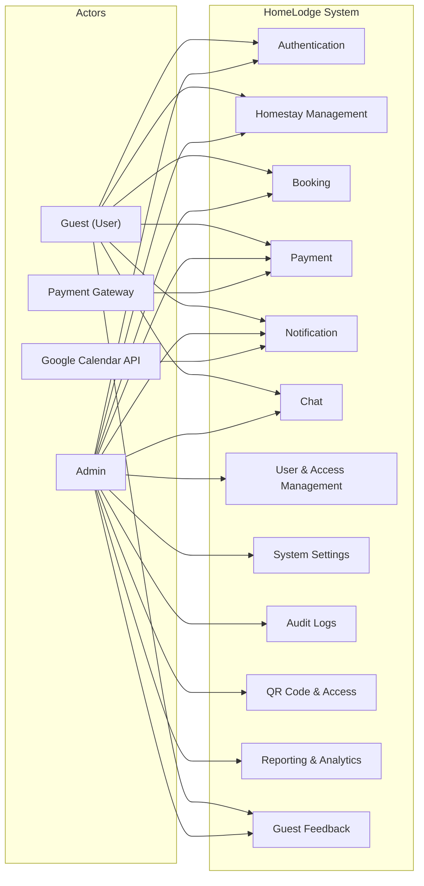
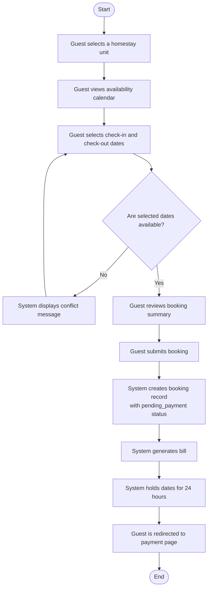
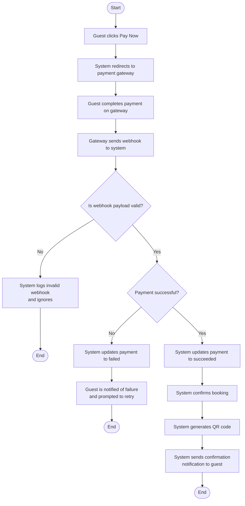
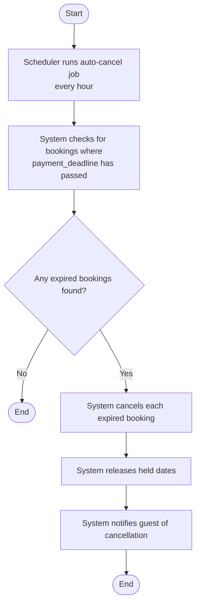
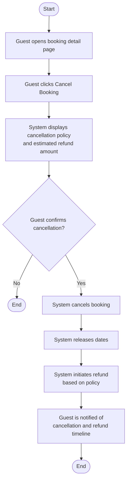
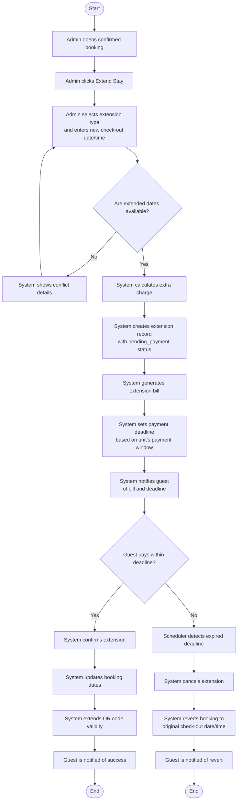
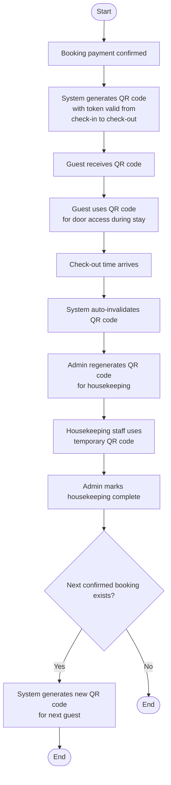
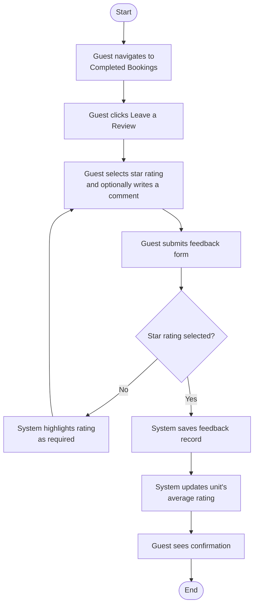
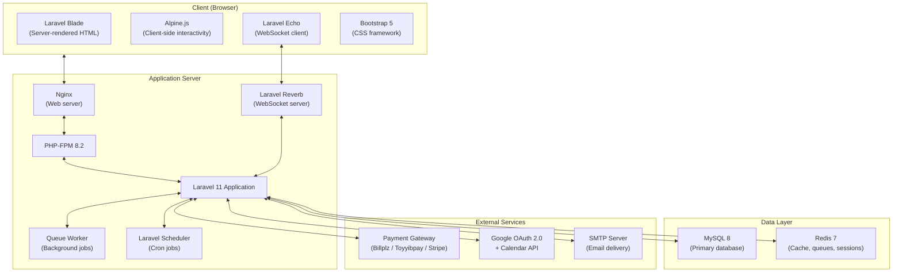
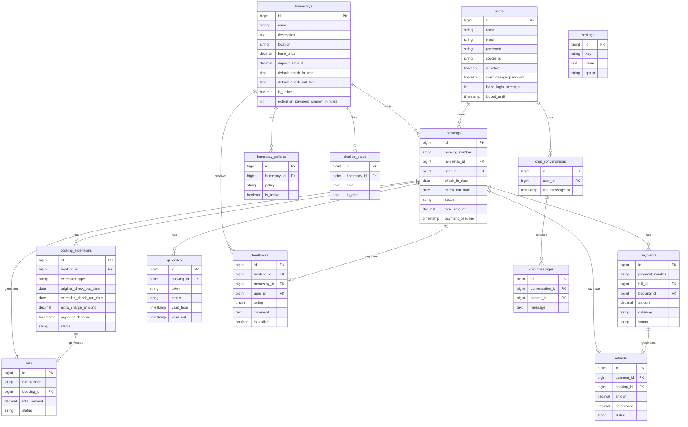

# CHAPTER 4: ANALYSIS AND DESIGN

## 4.1 Introduction

This chapter documents the results of the requirements analysis and system design phases described in Chapter 3. Section 4.2 presents the requirements analysis output: actor definitions, use case summaries for all twelve modules, and activity diagrams for the primary workflows. Section 4.3 presents the system design output: the system architecture, database schema, and user interface design. All analysis and design work was completed before implementation began.

---

## 4.2 Requirements Analysis Phase Workflow

Requirements analysis is a phase of the System Development Life Cycle (SDLC) in which user expectations are identified and documented. The requirements are studied, analysed, and described so that the final system addresses the problems users face. In this project, two types of UML diagram are used to define the system's scope and to show how one activity leads to the next: use case diagrams and activity diagrams.

This section presents the output of Phase 1 (Requirements Analysis) of the hybrid methodology described in Chapter 3. All functional requirements for HomeLodge were gathered, documented, and finalised before any design or implementation work began. The analysis produced a complete use case model with four actors and forty-seven use cases across twelve modules. The subsections below describe each actor, summarise every use case, and provide activity diagrams for the primary workflows.

### 4.2.1 Use Case Modelling

The use case model for HomeLodge was derived from the User Requirements Specification (URS) and the Product Requirements Document (PRD). The system has four actors and twelve modules, producing a total of forty-seven use cases. Figure 4.1 shows the system-level use case diagram.

Figure 4.1: System-Level Use Case Diagram


```mermaid
graph LR
    subgraph Actors
        Guest["Guest (User)"]
        Admin["Admin"]
        PG["Payment Gateway"]
        GCal["Google Calendar API"]
    end

    subgraph HomeLodge System
        AUTH["Authentication"]
        HS["Homestay Management"]
        BK["Booking"]
        PAY["Payment"]
        NOTIF["Notification"]
        CHAT["Chat"]
        USR["User & Access Management"]
        SET["System Settings"]
        AUDIT["Audit Logs"]
        QR["QR Code & Access"]
        RPT["Reporting & Analytics"]
        FB["Guest Feedback"]
    end

    Guest --> AUTH
    Guest --> HS
    Guest --> BK
    Guest --> PAY
    Guest --> NOTIF
    Guest --> CHAT
    Guest --> FB

    Admin --> AUTH
    Admin --> HS
    Admin --> BK
    Admin --> PAY
    Admin --> NOTIF
    Admin --> CHAT
    Admin --> USR
    Admin --> SET
    Admin --> AUDIT
    Admin --> QR
    Admin --> RPT
    Admin --> FB

    PG --> PAY
    GCal --> NOTIF
```

#### 4.2.1.1 Actor Descriptions

In a use case diagram, an actor is a person or an external system that interacts with the application. HomeLodge has four actors. The Guest and the Admin are the two human actors, and the other two are external systems the application depends on. Both human actors can access most of the same modules, though some features are specific to one or the other. The external actors do not start interactions on their own. They either respond to requests from HomeLodge or send a callback when something happens on their end. Table 4.1 lists each actor and their role in the system.

Table 4.1: Actor Descriptions

| Actor | Type | Description |
|---|---|---|
| Guest (User) | Human | A traveller or local who registers an account, browses homestay units, makes bookings, pays online, receives QR codes for door access, communicates with the admin through chat, and submits feedback after a completed stay. The guest can also view their booking history and payment records. |
| Admin | Human | The property owner or manager who oversees all operations. The admin manages homestay units, processes bookings, initiates booking extensions, controls user accounts and roles, configures system settings, generates reports, moderates guest feedback, and communicates with guests through chat. |
| Payment Gateway | External system | A third-party payment processor (Billplz, Toyyibpay, or Stripe) that processes online payments and sends webhook callbacks to HomeLodge when a payment event occurs. The system verifies the webhook payload before updating booking and payment records. |
| Google Calendar API | External system | The Google Calendar service that receives calendar event data from HomeLodge when a booking is confirmed. Confirmed bookings appear as events in the Google Calendar of both the guest and the admin. |

#### 4.2.1.2 Use Case Descriptions

This section summarises the use cases for each module. The full use case descriptions, including preconditions, postconditions, main flows, and alternative flows, are documented in the Use Case Descriptions reference document.

**Authentication Module**

The Authentication module has six use cases. Table 4.2 summarises them.

Table 4.2: Authentication Module Use Cases

| Use Case Name | Description |
|---|---|
| UC-AUTH-01: Register Account (Email / Password) | A new user registers with an email address and password. The system validates the inputs, creates the account with the Guest role, and sends a verification email. |
| UC-AUTH-02: Login / Login via Google SSO | A registered user logs in with email and password, or authenticates through Google OAuth 2.0. If the user signs in via Google and no account exists, one is created automatically. Account lockout and auto-unlock are handled as alternative flows within the login process. |
| UC-AUTH-03: Logout | The user ends their active session. The session token is invalidated and the user is redirected to the login page. |
| UC-AUTH-04: Forgot Password (Reset via Email) | The user requests a password reset link sent to their registered email address. A time-limited token is generated. If the account was locked, the lockout is lifted upon successful reset. |
| UC-AUTH-05: View / Update Profile | The user views and edits their profile information, including name, phone number, and profile photo. |
| UC-AUTH-06: Force Change Password | After an admin resets a user's password, the user is required to set a new password on next login before accessing any other page. |

**Homestay Management Module**

The Homestay Management module has six use cases. Table 4.3 summarises them.

Table 4.3: Homestay Management Module Use Cases

| Use Case Name | Description |
|---|---|
| UC-HS-01: Browse Homestay Units | The guest views a list of all active homestay units available for booking, showing unit names, thumbnails, base price, and location. |
| UC-HS-02: View Unit Details & Availability | The guest views full details of a unit, including description, images, pricing, check-in/out times, house policies, and a real-time availability calendar. |
| UC-HS-03: Create Homestay Unit | The admin creates a new unit with name, description, location, pricing, images, check-in/out times, and house policies. Default policies are automatically applied to the new unit on creation. Image upload and pricing configuration are handled as sub-steps within this flow. |
| UC-HS-04: Edit Homestay Unit | The admin updates the details of an existing unit, including its images, pricing, check-in/out times, and house policies. |
| UC-HS-05: Deactivate / Delete Unit | The admin deactivates or soft-deletes a unit. Units with confirmed future bookings cannot be deleted. |
| UC-HS-06: View All Units List | The admin views a list of all units with their status (active or inactive) and upcoming booking summaries. |

**Booking Module**

The Booking module has seven use cases. Table 4.4 summarises them.

Table 4.4: Booking Module Use Cases

| Use Case Name | Description |
|---|---|
| UC-BK-01: View Availability & Select Dates | The guest views a monthly availability calendar for a unit, selects check-in and check-out dates, and the system validates availability in real time. Calendar display, date selection, and availability checking are handled as a single continuous flow. |
| UC-BK-02: Submit Booking | The guest confirms and submits a booking. The system creates the booking record, generates a bill, and temporarily holds the selected dates for twenty-four hours to allow payment. |
| UC-BK-03: View Bookings | The guest or admin views a list of bookings with tabs for current (confirmed or pending) and past (completed or cancelled) records. Filtering and searching are available within the same view. |
| UC-BK-04: View Booking Details | The guest or admin views the full details of a specific booking, including status, dates, charges, and the applicable cancellation policy and refund information. |
| UC-BK-05: Cancel Booking | The guest or admin cancels a booking. The system displays the cancellation policy and estimated refund amount before the user confirms. Dates are released and the refund is initiated based on the configured policy. |
| UC-BK-06: Manage Booking (Admin) | The admin creates bookings on behalf of a user, edits or deletes existing bookings, and blocks specific dates on a unit to prevent new reservations. |
| UC-BK-07: Auto-Cancel Expired Booking | A scheduled job checks for bookings whose payment deadline has passed. The system cancels each expired booking, releases the held dates, and notifies the guest. |

**Payment Module**

The Payment module has three use cases. Table 4.5 summarises them.

Table 4.5: Payment Module Use Cases

| Use Case Name | Description |
|---|---|
| UC-PAY-01: Make Payment | The guest is redirected to the payment gateway to complete an online payment. After the transaction, the gateway sends a webhook callback to the system, which verifies the payload signature and updates payment, booking, and billing records accordingly. |
| UC-PAY-02: View Payment & Billing Records | The guest or admin views bills, payment transactions, and receipts. The admin can filter records by date range, unit, or payment status. Viewing and downloading receipts are part of this flow. |
| UC-PAY-03: Regenerate Bill / Receipt | The admin regenerates a bill or receipt PDF on demand for any booking or extension payment. |

**Notification Module**

The Notification module has two use cases. Table 4.6 summarises them.

Table 4.6: Notification Module Use Cases

| Use Case Name | Description |
|---|---|
| UC-NOTIF-01: Receive System Notification | The user receives real-time in-app notifications (bell icon with badge) and email notifications for system events such as booking confirmation, payment receipt, cancellation, extension billing, and payment reminders. All notification channels are handled within a single mechanism triggered by various system events. |
| UC-NOTIF-02: Google Calendar Integration | Confirmed bookings are synchronised to the user's Google Calendar as calendar events. The system sends event data to the Google Calendar API when a booking is confirmed. |

**Chat Module**

The Chat module has two use cases. Table 4.7 summarises them.

Table 4.7: Chat Module Use Cases

| Use Case Name | Description |
|---|---|
| UC-CHAT-01: Send / Receive Messages | The guest and admin exchange text messages through the built-in real-time chat. Messages are delivered instantly via WebSocket without requiring a page refresh. A typing indicator is shown while the other party composes a message. |
| UC-CHAT-02: View Chat History | The user views the full conversation history with the other party in chronological order. |

**User & Access Management Module**

The User & Access Management module has five use cases. Table 4.8 summarises them.

Table 4.8: User & Access Management Module Use Cases

| Use Case Name | Description |
|---|---|
| UC-USR-01: Create User Account | The admin manually creates a user account and assigns a role. The user is notified with a temporary password and must change it on first login. |
| UC-USR-02: Edit / Activate / Deactivate User | The admin updates a user's name, email, or role assignment, and toggles a user's active status. Deactivated users cannot log in. |
| UC-USR-03: Reset User Password | The admin resets a user's password to the default value and forces a password change on next login. |
| UC-USR-04: Manage Roles | The admin creates, edits, deletes, and assigns permissions to roles. A role assigned to one or more users cannot be deleted. Permission changes take effect immediately for all users with that role. |
| UC-USR-05: Manage Permissions | The admin creates, edits, and deletes permission keys. A permission attached to a role cannot be deleted. |

**System Settings Module**

The System Settings module has two use cases. Table 4.9 summarises them.

Table 4.9: System Settings Module Use Cases

| Use Case Name | Description |
|---|---|
| UC-SET-01: Configure System Settings | The admin configures all system-wide settings from a single settings page, including SMTP credentials, security parameters (lockout duration, session timeout, maximum failed login attempts), refund policy thresholds, extension charge rates, and extension payment window duration. |
| UC-SET-02: Manage Default Homestay Policies | The admin manages the default house policies that are automatically applied to every new homestay unit upon creation. |

**Audit Logs Module**

The Audit Logs module has two use cases. Table 4.10 summarises them.

Table 4.10: Audit Logs Module Use Cases

| Use Case Name | Description |
|---|---|
| UC-AUDIT-01: View / Filter Audit Trail | The admin views a chronological log of all user actions, admin changes, authentication events, and system events. The log can be filtered by date range, event type, or actor. |
| UC-AUDIT-02: Automatic Event Logging | The system automatically logs all auditable events as they occur. Logs are read-only and cannot be modified or deleted. |

**QR Code & Access Module**

The QR Code & Access module has five use cases. Table 4.11 summarises them.

Table 4.11: QR Code & Access Module Use Cases

| Use Case Name | Description |
|---|---|
| UC-QR-01: Receive & Use QR Code | After booking confirmation, the system generates a unique QR code and delivers it to the guest via in-app notification and email. The guest presents the QR code at the door during the valid period from check-in to check-out. |
| UC-QR-02: Manage Housekeeping Cycle | The admin manages the post-checkout housekeeping workflow. The system auto-invalidates the previous guest's QR code at checkout, the admin generates a temporary QR code for housekeeping staff, and once housekeeping is marked complete, the system generates a new QR code for the next confirmed booking. |
| UC-QR-03: Initiate Booking Extension | The admin initiates a booking extension by selecting an extension type and entering a new check-out date or time. The system checks availability, calculates the extra charge, creates an extension record, generates a bill, sets the payment deadline, and notifies the guest to pay. |
| UC-QR-04: Pay Extension Charge | The guest pays the additional extension charge via the payment gateway within the configured payment window. Upon successful payment, the system confirms the extension, updates the booking dates, and extends the QR code validity. |
| UC-QR-05: Auto-Cancel Extension | A scheduled job cancels extension records whose payment deadline has passed without payment. The system reverts the booking to the original check-out date and time and notifies the guest. |

**Reporting & Analytics Module**

The Reporting & Analytics module has three use cases. Table 4.12 summarises them.

Table 4.12: Reporting & Analytics Module Use Cases

| Use Case Name | Description |
|---|---|
| UC-RPT-01: View Analytics Dashboard | The admin views a dashboard with summary statistics including total bookings, revenue, occupancy rate, cancellation rate, booking trend charts, per-unit breakdowns, and guest feedback ratings. |
| UC-RPT-02: View Revenue Report | The admin views a detailed revenue report that can be filtered by date range, unit, and payment status. |
| UC-RPT-03: Export Report | The admin exports any report view as a downloadable PDF or CSV file. |

**Guest Feedback Module**

The Guest Feedback module has four use cases. Table 4.13 summarises them.

Table 4.13: Guest Feedback Module Use Cases

| Use Case Name | Description |
|---|---|
| UC-FB-01: Submit Rating & Feedback | After a completed stay, the guest submits a star rating (1–5) and an optional written comment. One feedback entry is allowed per completed booking. |
| UC-FB-02: View Submitted Feedback | The guest views all feedback they have previously submitted, including any admin reply. |
| UC-FB-03: View / Manage All Feedback (Admin) | The admin views all feedback and ratings for a specific unit or across all units, responds to guest reviews, and moderates feedback entries that violate content policies. Hidden feedback is retained in the database but removed from the public listing. |
| UC-FB-04: Display Average Rating | The system calculates and displays the average star rating on each unit's listing page, based only on visible feedback records. |

### 4.2.2 Activity Diagrams

This section presents activity diagrams for the primary workflows in HomeLodge. Each diagram traces the sequence of actions from start to end, including decision points and alternative paths.

#### 4.2.2.1 Guest Booking Flow

Figure 4.2 shows the activity flow when a guest creates a booking.

Figure 4.2: Activity Diagram — Guest Booking Flow


```mermaid
flowchart TD
    Start([Start]) --> A["Guest selects a homestay unit"]
    A --> B["Guest views availability calendar"]
    B --> C["Guest selects check-in and check-out dates"]
    C --> D{"Are selected dates available?"}
    D -- No --> E["System displays conflict message"]
    E --> C
    D -- Yes --> F["Guest reviews booking summary"]
    F --> G["Guest submits booking"]
    G --> H["System creates booking record\nwith pending_payment status"]
    H --> I["System generates bill"]
    I --> J["System holds dates for 24 hours"]
    J --> K["Guest is redirected to payment page"]
    K --> End([End])
```

#### 4.2.2.2 Payment Flow

Figure 4.3 shows the activity flow when a guest makes a payment.

Figure 4.3: Activity Diagram — Payment Flow


```mermaid
flowchart TD
    Start([Start]) --> A["Guest clicks Pay Now"]
    A --> B["System redirects to payment gateway"]
    B --> C["Guest completes payment on gateway"]
    C --> D["Gateway sends webhook to system"]
    D --> E{"Is webhook payload valid?"}
    E -- No --> F["System logs invalid webhook\nand ignores"]
    F --> End1([End])
    E -- Yes --> G{"Payment successful?"}
    G -- No --> H["System updates payment to failed"]
    H --> I["Guest is notified of failure\nand prompted to retry"]
    I --> End2([End])
    G -- Yes --> J["System updates payment to succeeded"]
    J --> K["System confirms booking"]
    K --> L["System generates QR code"]
    L --> M["System sends confirmation\nnotification to guest"]
    M --> End3([End])
```

#### 4.2.2.3 Auto-Cancellation Flow

Figure 4.4 shows the activity flow when a booking is auto-cancelled due to payment timeout.

Figure 4.4: Activity Diagram — Auto-Cancellation Flow


```mermaid
flowchart TD
    Start([Start]) --> A["Scheduler runs auto-cancel job\nevery hour"]
    A --> B["System checks for bookings where\npayment_deadline has passed"]
    B --> C{"Any expired bookings found?"}
    C -- No --> End1([End])
    C -- Yes --> D["System cancels each expired booking"]
    D --> E["System releases held dates"]
    E --> F["System notifies guest of cancellation"]
    F --> End2([End])
```

#### 4.2.2.4 Guest Cancellation Flow

Figure 4.5 shows the activity flow when a guest cancels a booking.

Figure 4.5: Activity Diagram — Guest Cancellation Flow


```mermaid
flowchart TD
    Start([Start]) --> A["Guest opens booking detail page"]
    A --> B["Guest clicks Cancel Booking"]
    B --> C["System displays cancellation policy\nand estimated refund amount"]
    C --> D{"Guest confirms cancellation?"}
    D -- No --> End1([End])
    D -- Yes --> E["System cancels booking"]
    E --> F["System releases dates"]
    F --> G["System initiates refund\nbased on policy"]
    G --> H["Guest is notified of\ncancellation and refund timeline"]
    H --> End2([End])
```

#### 4.2.2.5 Booking Extension Flow

Figure 4.6 shows the activity flow for a booking extension, from initiation by the admin through to payment or auto-cancellation.

Figure 4.6: Activity Diagram — Booking Extension Flow


```mermaid
flowchart TD
    Start([Start]) --> A["Admin opens confirmed booking"]
    A --> B["Admin clicks Extend Stay"]
    B --> C["Admin selects extension type\nand enters new check-out date/time"]
    C --> D{"Are extended dates available?"}
    D -- No --> E["System shows conflict details"]
    E --> C
    D -- Yes --> F["System calculates extra charge"]
    F --> G["System creates extension record\nwith pending_payment status"]
    G --> H["System generates extension bill"]
    H --> I["System sets payment deadline\nbased on unit's payment window"]
    I --> J["System notifies guest\nof bill and deadline"]
    J --> K{"Guest pays within deadline?"}
    K -- Yes --> L["System confirms extension"]
    L --> M["System updates booking dates"]
    M --> N["System extends QR code validity"]
    N --> O["Guest is notified of success"]
    O --> End1([End])
    K -- No --> P["Scheduler detects expired deadline"]
    P --> Q["System cancels extension"]
    Q --> R["System reverts booking to\noriginal check-out date/time"]
    R --> S["Guest is notified of revert"]
    S --> End2([End])
```

#### 4.2.2.6 QR Code Lifecycle Flow

Figure 4.7 shows the activity flow of a QR code from generation through to the housekeeping cycle.

Figure 4.7: Activity Diagram — QR Code Lifecycle


```mermaid
flowchart TD
    Start([Start]) --> A["Booking payment confirmed"]
    A --> B["System generates QR code\nwith token valid from\ncheck-in to check-out"]
    B --> C["Guest receives QR code"]
    C --> D["Guest uses QR code\nfor door access during stay"]
    D --> E["Check-out time arrives"]
    E --> F["System auto-invalidates QR code"]
    F --> G["Admin regenerates QR code\nfor housekeeping"]
    G --> H["Housekeeping staff uses\ntemporary QR code"]
    H --> I["Admin marks housekeeping complete"]
    I --> J{"Next confirmed booking exists?"}
    J -- Yes --> K["System generates new QR code\nfor next guest"]
    K --> End1([End])
    J -- No --> End2([End])
```

#### 4.2.2.7 Guest Feedback Submission Flow

Figure 4.8 shows the activity flow when a guest submits feedback.

Figure 4.8: Activity Diagram — Guest Feedback Submission


```mermaid
flowchart TD
    Start([Start]) --> A["Guest navigates to\nCompleted Bookings"]
    A --> B["Guest clicks Leave a Review"]
    B --> C["Guest selects star rating\nand optionally writes a comment"]
    C --> D["Guest submits feedback form"]
    D --> E{"Star rating selected?"}
    E -- No --> F["System highlights rating\nas required"]
    F --> C
    E -- Yes --> G["System saves feedback record"]
    G --> H["System updates unit's\naverage rating"]
    H --> I["Guest sees confirmation"]
    I --> End([End])
```

---

## 4.3 Design Phase Workflow

This section presents the output of Phase 2 (System Design) of the hybrid methodology. The design phase produced three outputs: the system architecture, the database schema, and the user interface design. All three were completed before any implementation began.

### 4.3.1 System Design

HomeLodge follows a Model-View-Controller (MVC) architecture implemented through the Laravel framework. Figure 4.9 shows the system architecture.

Figure 4.9: System Architecture Diagram


```mermaid
flowchart TB
    subgraph Client["Client (Browser)"]
        Blade["Laravel Blade\n(Server-rendered HTML)"]
        Alpine["Alpine.js\n(Client-side interactivity)"]
        Echo["Laravel Echo\n(WebSocket client)"]
        Bootstrap["Bootstrap 5\n(CSS framework)"]
    end

    subgraph Server["Application Server"]
        Nginx["Nginx\n(Web server)"]
        PHP["PHP-FPM 8.2"]
        Laravel["Laravel 11 Application"]
        Queue["Queue Worker\n(Background jobs)"]
        Scheduler["Laravel Scheduler\n(Cron jobs)"]
        Reverb["Laravel Reverb\n(WebSocket server)"]
    end

    subgraph Data["Data Layer"]
        MySQL["MySQL 8\n(Primary database)"]
        Redis["Redis 7\n(Cache, queues, sessions)"]
    end

    subgraph External["External Services"]
        PG["Payment Gateway\n(Billplz / Toyyibpay / Stripe)"]
        Google["Google OAuth 2.0\n+ Calendar API"]
        SMTP["SMTP Server\n(Email delivery)"]
    end

    Client <--> Nginx
    Nginx <--> PHP
    PHP <--> Laravel
    Laravel <--> MySQL
    Laravel <--> Redis
    Laravel <--> Queue
    Laravel <--> Scheduler
    Echo <--> Reverb
    Reverb <--> Laravel
    Laravel <--> PG
    Laravel <--> Google
    Laravel <--> SMTP
```

The architecture separates concerns as follows. Nginx receives HTTP requests and passes them to PHP-FPM. Laravel processes the request through its routing, middleware, and controller layers, queries the database through Eloquent ORM, and returns a Blade-rendered HTML response. Alpine.js adds client-side interactivity where the browser needs to hold state between interactions (the booking calendar, the notification counter, and the chat interface). Laravel Echo connects to the Reverb WebSocket server for real-time chat delivery. Background tasks such as auto-cancellation, QR expiry, and extension deadline enforcement run through queue workers and the scheduler, both of which operate independently of the HTTP request cycle. Redis backs the queue, cache, and session storage. External integrations — the payment gateway, Google OAuth and Calendar, and SMTP — go through Laravel's built-in HTTP and mail clients.

### 4.3.2 Database Design

The database schema was designed during Phase 2 and was finalised before any migration files were written. The schema uses MySQL 8 with Eloquent ORM. All tables follow Laravel conventions: `id` as a BIGINT UNSIGNED auto-incrementing primary key, `created_at` and `updated_at` timestamps, and `deleted_at` for soft-deletable tables.

Figure 4.10 shows the Entity-Relationship Diagram for the HomeLodge database.

Figure 4.10: Entity-Relationship Diagram


```mermaid
erDiagram
    homestays {
        bigint id PK
        string name
        text description
        string location
        decimal base_price
        decimal deposit_amount
        time default_check_in_time
        time default_check_out_time
        boolean is_active
        int extension_payment_window_minutes
    }

    users {
        bigint id PK
        string name
        string email
        string password
        string google_id
        boolean is_active
        boolean must_change_password
        int failed_login_attempts
        timestamp locked_until
    }

    bookings {
        bigint id PK
        string booking_number
        bigint homestay_id FK
        bigint user_id FK
        date check_in_date
        date check_out_date
        string status
        decimal total_amount
        timestamp payment_deadline
    }

    booking_extensions {
        bigint id PK
        bigint booking_id FK
        string extension_type
        date original_check_out_date
        date extended_check_out_date
        decimal extra_charge_amount
        timestamp payment_deadline
        string status
    }

    bills {
        bigint id PK
        string bill_number
        bigint booking_id FK
        decimal total_amount
        string status
    }

    payments {
        bigint id PK
        string payment_number
        bigint bill_id FK
        bigint booking_id FK
        decimal amount
        string gateway
        string status
    }

    refunds {
        bigint id PK
        bigint payment_id FK
        bigint booking_id FK
        decimal amount
        decimal percentage
        string status
    }

    qr_codes {
        bigint id PK
        bigint booking_id FK
        string token
        string status
        timestamp valid_from
        timestamp valid_until
    }

    feedbacks {
        bigint id PK
        bigint booking_id FK
        bigint homestay_id FK
        bigint user_id FK
        tinyint rating
        text comment
        boolean is_visible
    }

    homestay_policies {
        bigint id PK
        bigint homestay_id FK
        string policy
        boolean is_active
    }

    blocked_dates {
        bigint id PK
        bigint homestay_id FK
        date date
        date to_date
    }

    chat_conversations {
        bigint id PK
        bigint user_id FK
        timestamp last_message_at
    }

    chat_messages {
        bigint id PK
        bigint conversation_id FK
        bigint sender_id FK
        text message
    }

    settings {
        bigint id PK
        string key
        text value
        string group
    }

    homestays ||--o{ bookings : "hosts"
    homestays ||--o{ blocked_dates : "has"
    homestays ||--o{ homestay_policies : "has"
    homestays ||--o{ feedbacks : "receives"
    users ||--o{ bookings : "makes"
    bookings ||--|| bills : "generates"
    bookings ||--o{ payments : "has"
    bookings ||--o{ qr_codes : "has"
    bookings ||--o| refunds : "may have"
    bookings ||--o| feedbacks : "may have"
    bookings ||--o{ booking_extensions : "has"
    booking_extensions ||--o| bills : "generates"
    payments ||--o| refunds : "generates"
    users ||--o{ chat_conversations : "has"
    chat_conversations ||--o{ chat_messages : "contains"
```

The database has sixteen tables. Table 4.15 describes each table and its purpose.

Table 4.15: Database Table Descriptions

| Table | Purpose |
|---|---|
| `homestays` | Stores all managed homestay units with name, location, pricing, check-in/out times, and per-unit extension payment window. |
| `homestay_policies` | Stores configurable house policies per unit. Default policies are copied here on unit creation. |
| `users` | All system users (guests and admins) with authentication fields, lockout tracking, and profile data. |
| `roles`, `permissions`, pivot tables | Managed by `spatie/laravel-permission`. Stores role definitions, permission definitions, and their assignments. |
| `bookings` | The central reservation table. Each booking links to a user and a homestay unit, with status tracking and a payment deadline. |
| `booking_extensions` | Records each extension request with original and extended dates, charge amount, payment deadline, and status lifecycle. |
| `bills` | Billing documents generated per booking or per extension, with bill number, amounts, and payment status. |
| `payments` | Individual payment transactions processed by the gateway, with gateway reference and webhook payload for audit. |
| `refunds` | Refund records for cancelled bookings, with percentage applied and processing status. |
| `blocked_dates` | Admin-blocked date ranges per unit to prevent bookings. |
| `qr_codes` | QR codes generated per booking with unique secure token, validity window, and status (active/expired/revoked). |
| `feedbacks` | Guest ratings and comments per completed booking, with admin reply and visibility moderation. |
| `chat_conversations` | One conversation per guest-admin pairing. |
| `chat_messages` | Individual messages within conversations, with sender identification and read tracking. |
| `activity_log` | Managed by `spatie/laravel-activitylog`. Read-only audit trail of all system events. |
| `settings` | Key-value store for all configurable system settings, grouped by category (SMTP, security, payment, extension, policy). |

Key design decisions in the schema are:

1. **Foreign key constraints** enforce referential integrity at the database level. A booking cannot reference a nonexistent user or homestay unit.
2. **Soft deletes** on `homestays`, `users`, and `bookings` allow records to be archived without losing historical data. Soft-deleted records remain in the database but are excluded from normal queries.
3. **The `booking_extensions` table** stores the original check-out date and time alongside the requested extension. If the extension payment is not received, the system uses these stored values to revert the booking without ambiguity.
4. **The `gateway_reference` column** in the `payments` table has a unique index. This ensures that the same webhook notification processed twice does not create a duplicate payment record (idempotency).
5. **The `settings` table** uses a key-value model so that new configuration parameters can be added without schema migrations.

### 4.3.3 User Interface Design

The user interface was designed for two user groups: guests who browse and book, and admin who manage operations. Each group has its own layout.

**Guest Interface**

The guest interface uses a top navigation bar with the site logo, main navigation links (Home, My Bookings, Notifications), and a user avatar dropdown. Page content is displayed in a centred container with a maximum width of 1200 pixels. Figure 4.11 shows the guest layout structure.

Figure 4.11: Guest Layout Structure

```
┌─────────────────────────────────────────────────────┐
│                      Top Navbar                      │
│  [Logo]   Home  My Bookings  Notifications  [Avatar] │
└─────────────────────────────────────────────────────┘
│                                                       │
│                   Page Content Area                   │
│                                                       │
└─────────────────────────────────────────────────────┘
│                       Footer                          │
└─────────────────────────────────────────────────────┘
```

The booking flow follows a linear sequence: the guest browses units, selects dates on a calendar, reviews a booking summary, submits the booking, and is redirected to the payment gateway. After payment, the guest receives a confirmation with the QR code accessible from the booking detail page.

**Admin Interface**

The admin interface uses a fixed left sidebar with grouped navigation items, and a top header bar showing the current page title and notification indicator. The sidebar groups are organised by function. Figure 4.12 shows the admin layout structure.

Figure 4.12: Admin Layout Structure

```
┌──────────┬──────────────────────────────────────────┐
│          │              Top Header Bar               │
│          │  [Page Title]           [Notifications]  │
│ Side-    ├──────────────────────────────────────────┤
│ bar      │                                           │
│          │              Page Content Area             │
│ (Fixed)  │                                           │
│          │                                           │
└──────────┴──────────────────────────────────────────┘
```

Table 4.16 lists the admin sidebar navigation groups.

Table 4.16: Admin Sidebar Navigation Groups

| Group | Items |
|---|---|
| Dashboard | Dashboard Overview, Reports & Analytics |
| Homestays | All Units, Policies & Rules |
| Bookings | Booking Calendar, All Bookings |
| Payments | Bills, Payments |
| QR Access | QR Codes, Housekeeping |
| Guests | Feedback & Ratings |
| Users | Manage Users |
| Access Control | Roles, Permissions |
| Communication | Chat |
| System | Settings, Audit Logs |

**Design System**

The interface uses Inter (from Google Fonts) as the primary typeface, an 8-pixel base spacing grid, and a defined colour palette. Status badges use colour-coded labels: green for confirmed, amber for pending payment, red for cancelled, grey for blocked, blue for completed, and teal for extended. All interactive elements (buttons, form inputs, links) have visible focus indicators and hover states. Tables use striped rows for readability. The booking calendar highlights available dates in green, booked dates in red, blocked dates in grey, and temporarily held dates in amber.

The interface is responsive across three breakpoints: mobile (below 640 pixels), tablet (640 to 1024 pixels), and desktop (above 1024 pixels). On mobile, the admin sidebar collapses to a hamburger menu. Tables scroll horizontally or convert to card-based layouts. All modals become full-screen on small devices.

---

## 4.4 Chapter Summary

This chapter presented the outputs of the requirements analysis and system design phases of the HomeLodge development methodology.

The requirements analysis produced a complete use case model with four actors and forty-seven use cases spread across twelve modules. Each use case was traced back to its source requirements in the URS and PRD. Activity diagrams were provided for the seven primary workflows: guest booking, payment processing, auto-cancellation, guest cancellation, booking extension, QR code lifecycle, and guest feedback submission.

The system design produced three outputs. The system architecture follows the MVC pattern implemented through Laravel, with Nginx, PHP-FPM, MySQL, Redis, and the Reverb WebSocket server as the infrastructure. The database schema has sixteen tables with foreign key constraints, soft deletes on archivable records, and a key-value settings table for configuration without schema changes. The user interface separates the guest experience (top navbar, linear booking flow) from the admin experience (fixed sidebar, grouped navigation), with a responsive design system based on Inter typography, an 8-pixel grid, and colour-coded status indicators.
