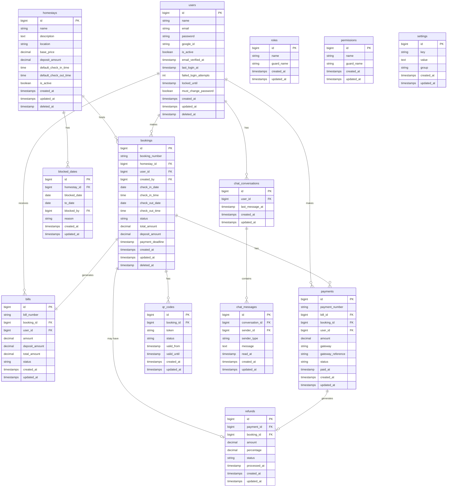

# Database Schema
## HomeLodge – Booking Homestay System

| Field | Detail |
|---|---|
| **Document Version** | 1.0 |
| **Status** | Draft |
| **Last Updated** | 2026-03-03 |

---

## Table of Contents

1. [Overview](#1-overview)
2. [Entity-Relationship Diagram](#2-entity-relationship-diagram)
3. [Table Definitions](#3-table-definitions)
   - [homestays](#31-homestays)
   - [users](#32-users)
   - [roles & permissions (Spatie)](#33-roles--permissions-spatie)
   - [bookings](#34-bookings)
   - [payments](#35-payments)
   - [bills](#36-bills)
   - [blocked_dates](#37-blocked_dates)
   - [qr_codes](#38-qr_codes)
   - [chat_conversations](#39-chat_conversations)
   - [chat_messages](#310-chat_messages)
   - [activity_logs](#311-activity_logs)
   - [settings](#312-settings)
4. [Indexes & Keys Summary](#4-indexes--keys-summary)
5. [Naming Conventions](#5-naming-conventions)

---

## 1. Overview

The database is **MySQL 8.x / MariaDB 10.x**. The ORM is **Laravel Eloquent**.

All tables follow these conventions:
- Primary key: `id` (BIGINT UNSIGNED, auto-increment).
- Timestamps: `created_at` and `updated_at` (Laravel standard).
- Soft deletes: `deleted_at` on tables where records should be archivable (e.g., bookings, users).
- Foreign keys reference parent primary keys and use `ON DELETE` constraints to protect referential integrity.

---

## 2. Entity-Relationship Diagram

---

## 3. Table Definitions

### 3.1 `homestays`

Stores all managed homestay units.

| Column | Type | Nullable | Default | Description |
|---|---|---|---|---|
| `id` | BIGINT UNSIGNED | No | AUTO_INCREMENT | Primary key |
| `name` | VARCHAR(255) | No | | Name of the homestay unit |
| `description` | TEXT | Yes | NULL | Full description shown to guests |
| `location` | VARCHAR(255) | No | | Address or area |
| `base_price` | DECIMAL(10,2) | No | | Nightly rate |
| `deposit_amount` | DECIMAL(10,2) | No | `0.00` | Required deposit per booking |
| `default_check_in_time` | TIME | No | `15:00:00` | Default check-in time for this unit |
| `default_check_out_time` | TIME | No | `12:00:00` | Default check-out time for this unit |
| `is_active` | BOOLEAN | No | `true` | Whether the unit is visible and bookable |
| `created_at` | TIMESTAMP | No | | |
| `updated_at` | TIMESTAMP | No | | |
| `deleted_at` | TIMESTAMP | Yes | NULL | Soft delete timestamp |

**Indexes:** `INDEX(is_active)`

> **Related table:** `homestay_images` — stores one or more image paths per unit (`id`, `homestay_id` FK, `path`, `sort_order`, `created_at`).

---

### 3.2 `users`

Stores all system users (guests and admins).

| Column | Type | Nullable | Default | Description |
|---|---|---|---|---|
| `id` | BIGINT UNSIGNED | No | AUTO_INCREMENT | Primary key |
| `name` | VARCHAR(255) | No | | Full name |
| `email` | VARCHAR(255) | No | | Unique email address |
| `email_verified_at` | TIMESTAMP | Yes | NULL | When email was verified |
| `password` | VARCHAR(255) | Yes | NULL | Hashed password (null for SSO-only accounts) |
| `google_id` | VARCHAR(255) | Yes | NULL | Google OAuth user ID |
| `avatar` | VARCHAR(255) | Yes | NULL | Profile picture URL |
| `phone` | VARCHAR(30) | Yes | NULL | Contact phone number |
| `is_active` | BOOLEAN | No | `true` | Whether account is active |
| `must_change_password` | BOOLEAN | No | `false` | Force password change on next login |
| `failed_login_attempts` | INT | No | `0` | Count of consecutive failed logins |
| `locked_until` | TIMESTAMP | Yes | NULL | Account locked until this time |
| `last_login_at` | TIMESTAMP | Yes | NULL | Timestamp of last successful login |
| `remember_token` | VARCHAR(100) | Yes | NULL | Laravel remember-me token |
| `created_at` | TIMESTAMP | No | | |
| `updated_at` | TIMESTAMP | No | | |
| `deleted_at` | TIMESTAMP | Yes | NULL | Soft delete timestamp |

**Indexes:** `UNIQUE(email)`, `INDEX(google_id)`

---

### 3.3 Roles & Permissions (Spatie)

Managed by the `spatie/laravel-permission` package. The following tables are created automatically:

| Table | Description |
|---|---|
| `roles` | Role definitions (e.g., Admin, User) |
| `permissions` | Permission definitions (e.g., `booking.create`, `user.delete`) |
| `model_has_roles` | Pivot: assigns roles to users |
| `model_has_permissions` | Pivot: assigns permissions directly to users |
| `role_has_permissions` | Pivot: assigns permissions to roles |

Refer to [Spatie Laravel Permission documentation](https://spatie.be/docs/laravel-permission) for the full schema.

**Default Roles:**

| Role | Description |
|---|---|
| `Admin` | Full system access |
| `User` | Guest / customer access |

---

### 3.4 `bookings`

The central table for all homestay reservations. Each booking is linked to a specific homestay unit.

| Column | Type | Nullable | Default | Description |
|---|---|---|---|---|
| `id` | BIGINT UNSIGNED | No | AUTO_INCREMENT | Primary key |
| `booking_number` | VARCHAR(30) | No | | Unique human-readable booking reference (e.g., `BK-20260303-001`) |
| `homestay_id` | BIGINT UNSIGNED | No | | The booked unit (FK → `homestays.id`) |
| `user_id` | BIGINT UNSIGNED | No | | Guest who holds the booking (FK → `users.id`) |
| `created_by` | BIGINT UNSIGNED | Yes | NULL | Admin who created booking on behalf of user (FK → `users.id`) |
| `check_in_date` | DATE | No | | Check-in date |
| `check_in_time` | TIME | No | `15:00:00` | Check-in time (default: 3:00 PM) |
| `check_out_date` | DATE | No | | Check-out date |
| `check_out_time` | TIME | No | `12:00:00` | Check-out time (default: 12:00 PM) |
| `status` | ENUM | No | `pending_payment` | See status values below |
| `total_amount` | DECIMAL(10,2) | No | | Total booking amount |
| `deposit_amount` | DECIMAL(10,2) | No | `0.00` | Deposit portion of total |
| `payment_deadline` | TIMESTAMP | Yes | NULL | Deadline for payment before auto-cancel |
| `notes` | TEXT | Yes | NULL | Admin or guest notes |
| `created_at` | TIMESTAMP | No | | |
| `updated_at` | TIMESTAMP | No | | |
| `deleted_at` | TIMESTAMP | Yes | NULL | Soft delete |

**Booking Status Values:**

| Status | Description |
|---|---|
| `pending_payment` | Booking submitted, payment not yet made |
| `confirmed` | Payment received; booking is active |
| `cancelled` | Booking cancelled (by guest or admin) |
| `completed` | Guest has checked out |

**Indexes:** `UNIQUE(booking_number)`, `INDEX(homestay_id)`, `INDEX(user_id)`, `INDEX(check_in_date, check_out_date)`, `INDEX(status)`

---

### 3.5 `payments`

Records each payment transaction processed by the payment gateway.

| Column | Type | Nullable | Default | Description |
|---|---|---|---|---|
| `id` | BIGINT UNSIGNED | No | AUTO_INCREMENT | Primary key |
| `payment_number` | VARCHAR(30) | No | | Unique payment reference (e.g., `PAY-20260303-001`) |
| `bill_id` | BIGINT UNSIGNED | No | | Linked bill (FK → `bills.id`) |
| `booking_id` | BIGINT UNSIGNED | No | | Linked booking (FK → `bookings.id`) |
| `user_id` | BIGINT UNSIGNED | No | | Payer (FK → `users.id`) |
| `amount` | DECIMAL(10,2) | No | | Amount paid |
| `gateway` | VARCHAR(50) | No | | Payment gateway name (e.g., `billplz`, `stripe`) |
| `gateway_reference` | VARCHAR(255) | Yes | NULL | Gateway-specific transaction ID |
| `gateway_payload` | JSON | Yes | NULL | Raw webhook payload for audit |
| `status` | ENUM | No | `pending` | `pending`, `succeeded`, `failed`, `refunded` |
| `paid_at` | TIMESTAMP | Yes | NULL | When payment was confirmed |
| `created_at` | TIMESTAMP | No | | |
| `updated_at` | TIMESTAMP | No | | |

**Indexes:** `UNIQUE(payment_number)`, `UNIQUE(gateway_reference)` (for idempotency), `INDEX(booking_id)`, `INDEX(status)`

---

### 3.6 `bills`

Stores billing documents generated per booking.

| Column | Type | Nullable | Default | Description |
|---|---|---|---|---|
| `id` | BIGINT UNSIGNED | No | AUTO_INCREMENT | Primary key |
| `bill_number` | VARCHAR(30) | No | | Unique bill reference (e.g., `BILL-20260303-001`) |
| `booking_id` | BIGINT UNSIGNED | No | | FK → `bookings.id` |
| `user_id` | BIGINT UNSIGNED | No | | Guest FK → `users.id` |
| `subtotal` | DECIMAL(10,2) | No | | Base accommodation cost |
| `deposit_amount` | DECIMAL(10,2) | No | `0.00` | Deposit amount |
| `total_amount` | DECIMAL(10,2) | No | | Total payable |
| `status` | ENUM | No | `unpaid` | `unpaid`, `paid`, `cancelled` |
| `issued_at` | TIMESTAMP | No | | When the bill was generated |
| `created_at` | TIMESTAMP | No | | |
| `updated_at` | TIMESTAMP | No | | |

**Indexes:** `UNIQUE(bill_number)`, `INDEX(booking_id)`

---

### 3.7 `refunds`

Tracks refund records for cancelled bookings.

| Column | Type | Nullable | Default | Description |
|---|---|---|---|---|
| `id` | BIGINT UNSIGNED | No | AUTO_INCREMENT | Primary key |
| `booking_id` | BIGINT UNSIGNED | No | | FK → `bookings.id` |
| `payment_id` | BIGINT UNSIGNED | No | | FK → `payments.id` |
| `amount` | DECIMAL(10,2) | No | | Refund amount |
| `percentage` | DECIMAL(5,2) | No | | Refund percentage applied |
| `status` | ENUM | No | `pending` | `pending`, `processed`, `failed` |
| `processed_at` | TIMESTAMP | Yes | NULL | When refund was completed |
| `notes` | TEXT | Yes | NULL | Admin notes |
| `created_at` | TIMESTAMP | No | | |
| `updated_at` | TIMESTAMP | No | | |

---

### 3.8 `blocked_dates`

Dates that admin has locked to prevent bookings on a specific unit.

| Column | Type | Nullable | Default | Description |
|---|---|---|---|---|
| `id` | BIGINT UNSIGNED | No | AUTO_INCREMENT | Primary key |
| `homestay_id` | BIGINT UNSIGNED | No | | The unit being blocked (FK → `homestays.id`) |
| `date` | DATE | No | | Start of the blocked period |
| `to_date` | DATE | No | | End of the blocked period |
| `blocked_by` | BIGINT UNSIGNED | No | | Admin who set the block (FK → `users.id`) |
| `reason` | TEXT | Yes | NULL | Internal admin reason (not shown to guests) |
| `created_at` | TIMESTAMP | No | | |
| `updated_at` | TIMESTAMP | No | | |

**Indexes:** `INDEX(homestay_id)`, `INDEX(date)`

---

### 3.9 `qr_codes`

QR codes generated per booking for physical door access.

| Column | Type | Nullable | Default | Description |
|---|---|---|---|---|
| `id` | BIGINT UNSIGNED | No | AUTO_INCREMENT | Primary key |
| `booking_id` | BIGINT UNSIGNED | No | | FK → `bookings.id` |
| `token` | VARCHAR(255) | No | | Unique secure token encoded in the QR |
| `status` | ENUM | No | `active` | `active`, `expired`, `revoked` |
| `purpose` | ENUM | No | `guest` | `guest`, `housekeeping` |
| `valid_from` | TIMESTAMP | No | | When QR becomes active |
| `valid_until` | TIMESTAMP | No | | When QR expires |
| `revoked_at` | TIMESTAMP | Yes | NULL | When manually revoked |
| `revoked_by` | BIGINT UNSIGNED | Yes | NULL | Admin who revoked (FK → `users.id`) |
| `created_at` | TIMESTAMP | No | | |
| `updated_at` | TIMESTAMP | No | | |

**Indexes:** `UNIQUE(token)`, `INDEX(booking_id)`, `INDEX(status)`

---

### 3.10 `chat_conversations`

One conversation per user ↔ admin pairing.

| Column | Type | Nullable | Default | Description |
|---|---|---|---|---|
| `id` | BIGINT UNSIGNED | No | AUTO_INCREMENT | Primary key |
| `user_id` | BIGINT UNSIGNED | No | | The guest user (FK → `users.id`) |
| `last_message_at` | TIMESTAMP | Yes | NULL | For sorting conversations by recency |
| `created_at` | TIMESTAMP | No | | |
| `updated_at` | TIMESTAMP | No | | |

**Indexes:** `UNIQUE(user_id)` (one conversation per user)

---

### 3.11 `chat_messages`

Individual messages within a conversation.

| Column | Type | Nullable | Default | Description |
|---|---|---|---|---|
| `id` | BIGINT UNSIGNED | No | AUTO_INCREMENT | Primary key |
| `conversation_id` | BIGINT UNSIGNED | No | | FK → `chat_conversations.id` |
| `sender_id` | BIGINT UNSIGNED | No | | Sending user (FK → `users.id`) |
| `sender_type` | ENUM | No | | `user` or `admin` |
| `message` | TEXT | No | | Message content |
| `read_at` | TIMESTAMP | Yes | NULL | When the recipient read the message |
| `created_at` | TIMESTAMP | No | | |
| `updated_at` | TIMESTAMP | No | | |

**Indexes:** `INDEX(conversation_id)`, `INDEX(sender_id)`

---

### 3.12 `activity_log` (Spatie Activity Log)

Managed by `spatie/laravel-activitylog`. Stores the audit trail.

| Column | Type | Description |
|---|---|---|
| `id` | BIGINT UNSIGNED | Primary key |
| `log_name` | VARCHAR | Log category (e.g., `auth`, `booking`, `admin`) |
| `description` | TEXT | Human-readable action description |
| `subject_type` | VARCHAR | Eloquent model class name |
| `subject_id` | BIGINT | ID of the affected model |
| `causer_type` | VARCHAR | Who performed the action (e.g., `App\Models\User`) |
| `causer_id` | BIGINT | ID of the user who performed the action |
| `properties` | JSON | Before/after state or additional context |
| `created_at` | TIMESTAMP | When the event occurred |

---

### 3.13 `settings`

Key-value store for all configurable system settings.

| Column | Type | Nullable | Default | Description |
|---|---|---|---|---|
| `id` | BIGINT UNSIGNED | No | AUTO_INCREMENT | Primary key |
| `key` | VARCHAR(100) | No | | Unique setting key (e.g., `smtp.host`) |
| `value` | TEXT | Yes | NULL | Setting value |
| `group` | VARCHAR(50) | No | `general` | Grouping: `smtp`, `security`, `payment`, `notification`, `general` |
| `created_at` | TIMESTAMP | No | | |
| `updated_at` | TIMESTAMP | No | | |

**Indexes:** `UNIQUE(key)`

**Default Setting Keys:**

| Key | Group | Description |
|---|---|---|
| `smtp.host` | `smtp` | SMTP server hostname |
| `smtp.port` | `smtp` | SMTP server port |
| `smtp.username` | `smtp` | SMTP username |
| `smtp.password` | `smtp` | SMTP password (encrypted) |
| `smtp.encryption` | `smtp` | `tls` or `ssl` |
| `security.lockout_duration` | `security` | Minutes before auto-unlock |
| `security.session_timeout` | `security` | Minutes of inactivity before logout |
| `security.max_attempts` | `security` | Max failed login attempts |
| `payment.payment_hold_hours` | `payment` | Hours to hold date before auto-cancel (default: 24) |
| `payment.refund_3day_pct` | `payment` | Refund % for <3 day cancellation (default: 0) |
| `payment.refund_1week_pct` | `payment` | Refund % for <1 week cancellation (default: 25) |
| `payment.refund_2week_pct` | `payment` | Refund % for <2 week cancellation (default: 50) |
| `notification.email_enabled` | `notification` | `true`/`false` — global email toggle |

---

## 4. Indexes & Keys Summary

| Table | Key Type | Columns |
|---|---|---|
| `homestays` | INDEX | `is_active` |
| `users` | UNIQUE | `email` |
| `users` | INDEX | `google_id` |
| `bookings` | UNIQUE | `booking_number` |
| `bookings` | INDEX | `homestay_id`, `user_id`, `status`, `check_in_date` |
| `bills` | UNIQUE | `bill_number` |
| `bills` | INDEX | `booking_id` |
| `payments` | UNIQUE | `payment_number`, `gateway_reference` |
| `payments` | INDEX | `booking_id`, `status` |
| `blocked_dates` | INDEX | `homestay_id`, `date` |
| `qr_codes` | UNIQUE | `token` |
| `qr_codes` | INDEX | `booking_id`, `status` |
| `chat_conversations` | UNIQUE | `user_id` |
| `settings` | UNIQUE | `key` |

---

## 5. Naming Conventions

| Convention | Rule |
|---|---|
| Table names | `snake_case`, plural (e.g., `bookings`, `chat_messages`) |
| Column names | `snake_case` (e.g., `check_in_date`, `payment_number`) |
| Foreign keys | `{referenced_table_singular}_id` (e.g., `booking_id`, `user_id`) |
| ENUM values | `snake_case` lowercase (e.g., `pending_payment`, `confirmed`) |
| Boolean columns | Prefix with `is_` or `has_` (e.g., `is_active`, `must_change_password`) |
| Timestamp columns | Suffix with `_at` (e.g., `paid_at`, `locked_until`) |
