# Use Case Diagrams
## HomeLodge – Booking Homestay System

| Field | Detail |
|---|---|
| **Document Version** | 1.0 |
| **Status** | Draft |
| **Last Updated** | 2026-03-28 |
| **Owner** | Product / Business Analysis Team |

---

## Table of Contents

1. [System Overview](#1-system-overview)
2. [Authentication Module](#2-authentication-module)
3. [Homestay Management Module](#3-homestay-management-module)
4. [Booking Module](#4-booking-module)
5. [Payment Module](#5-payment-module)
6. [Notification Module](#6-notification-module)
7. [Chat Module](#7-chat-module)
8. [User Management Module](#8-user-management-module)
9. [Role & Permission Module](#9-role--permission-module)
10. [System Settings Module](#10-system-settings-module)
11. [Audit Logs Module](#11-audit-logs-module)
12. [QR Code Door Access Module](#12-qr-code-door-access-module)

---

## 1. System Overview

This diagram shows a high-level view of all actors and their interaction areas within the HomeLodge system.

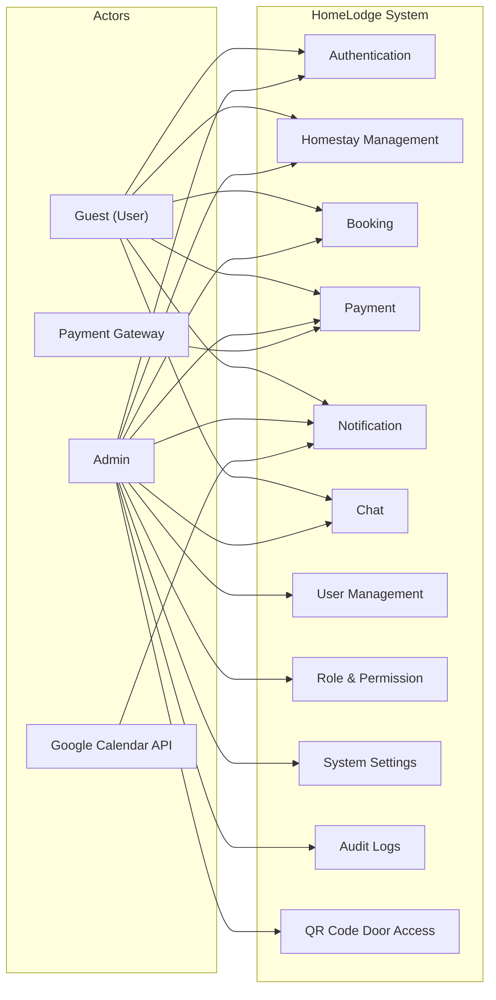

---

## 2. Authentication Module

Covers registration, login, logout, password management, and profile management for both Guest and Admin.

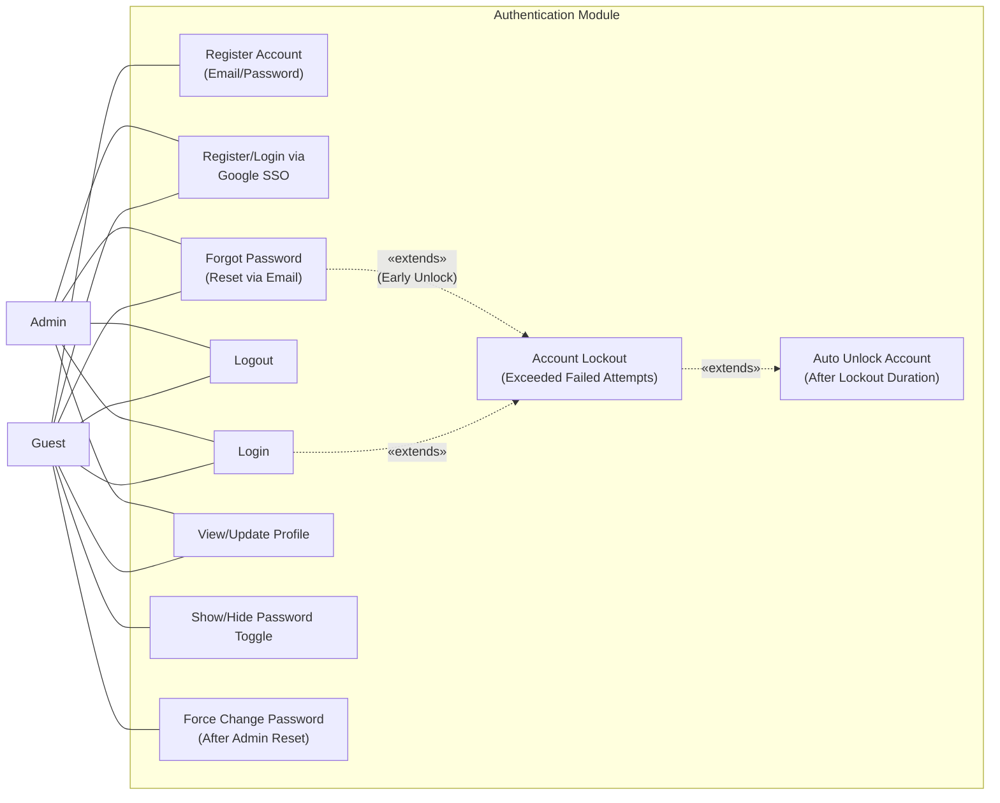

---

## 3. Homestay Management Module

Covers listing, creation, editing, and deactivation of homestay units by the admin, and browsing of units by guests.

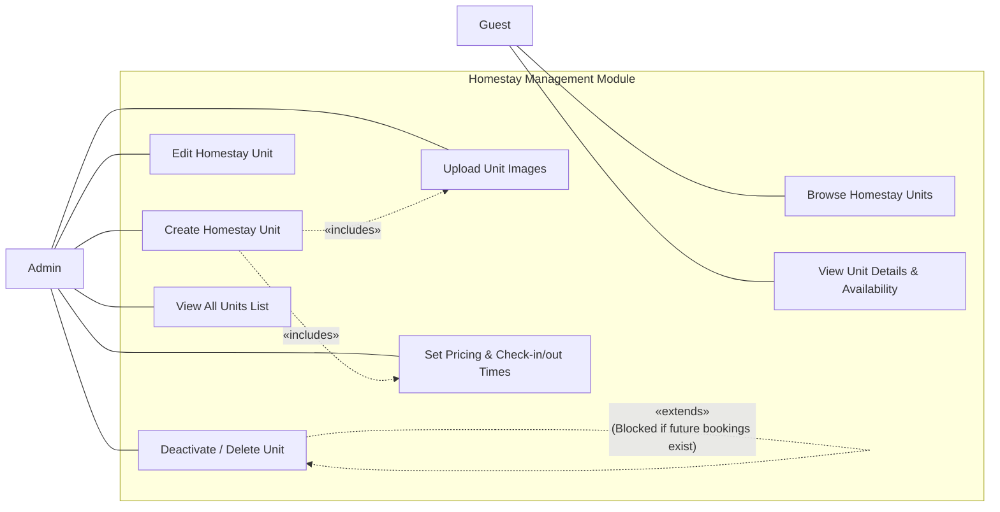

---

## 4. Booking Module

Covers booking creation, viewing, cancellation, calendar management, and date blocking. All bookings are scoped to a specific homestay unit.

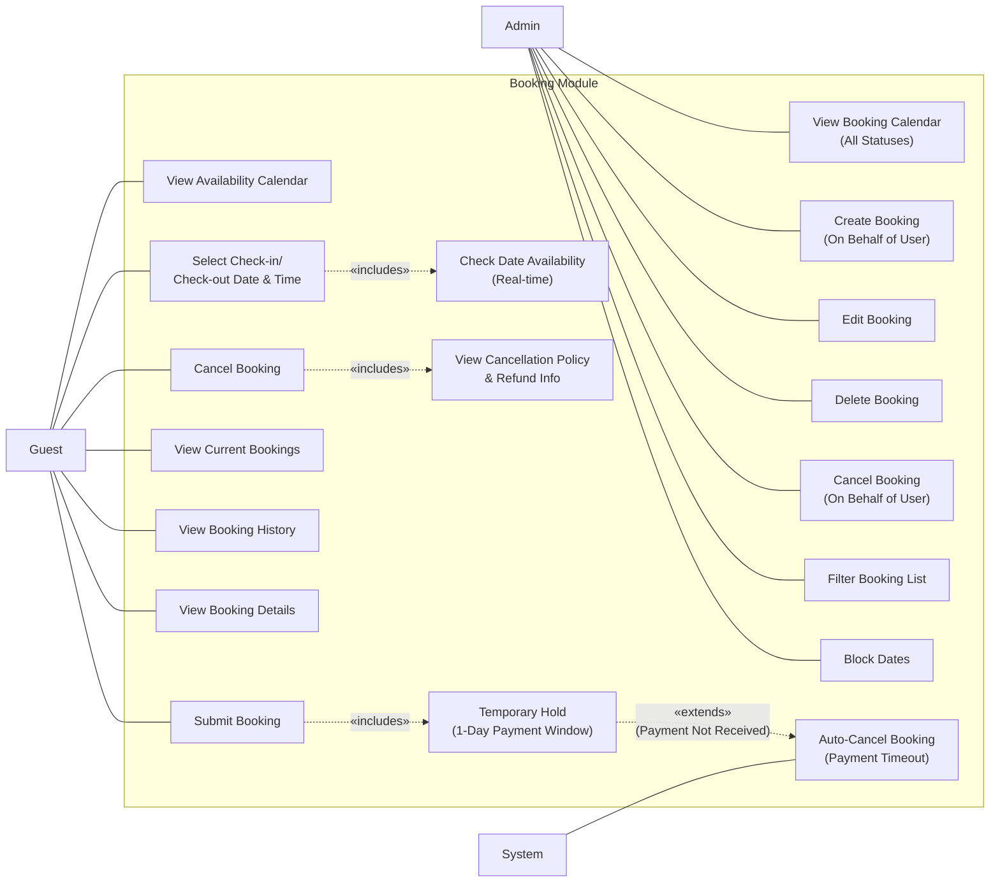

---

## 5. Payment Module

Covers payment processing, billing, receipts, and refund handling.

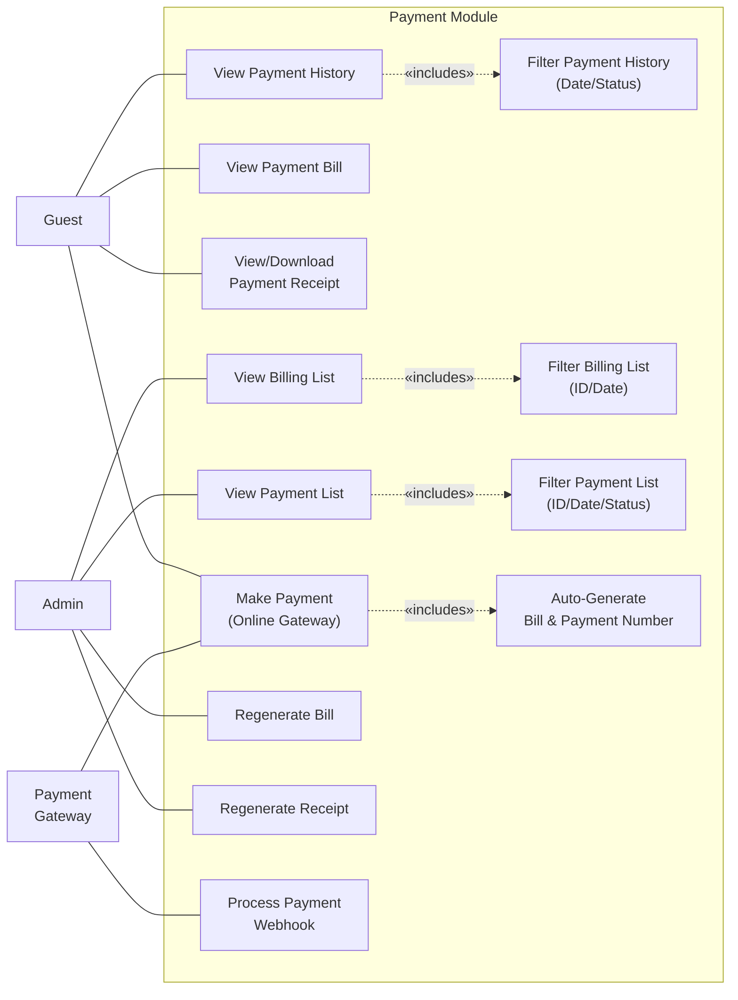

---

## 6. Notification Module

Covers in-app notifications, email notifications, reminders, and Google Calendar integration.

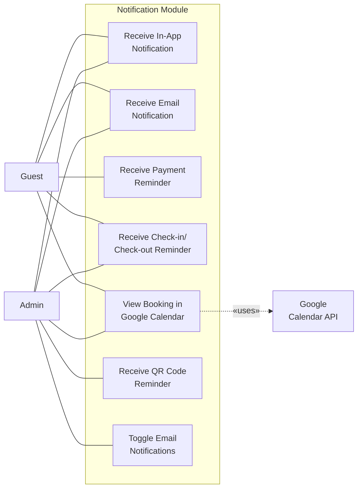

---

## 7. Chat Module

Covers real-time messaging between Guest and Admin via WebSocket.

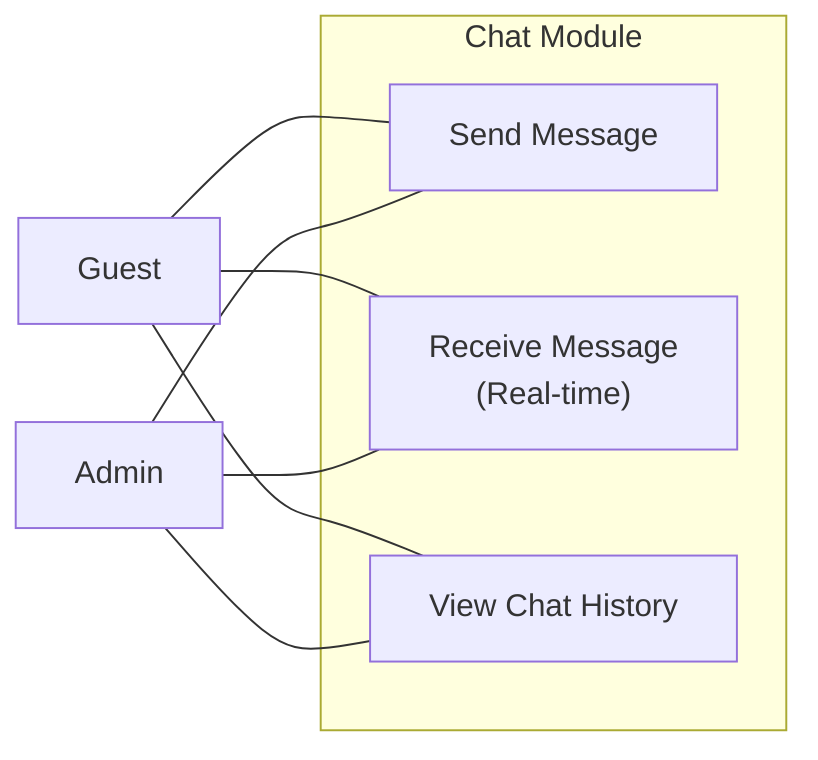

---

## 8. User Management Module

Admin-only module for managing user accounts.

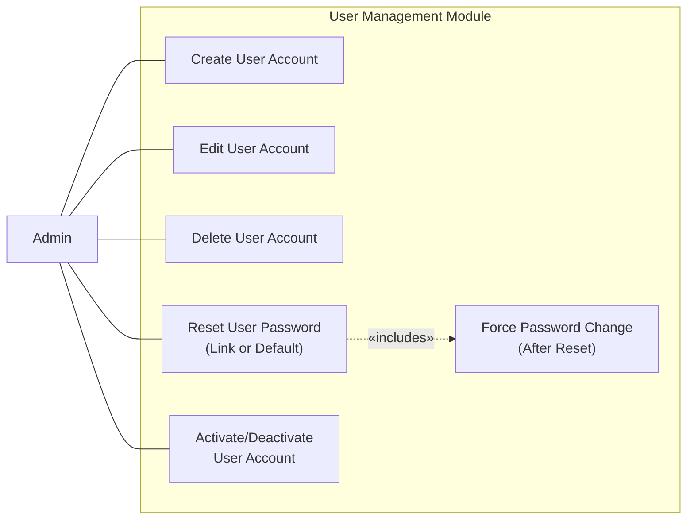

---

## 9. Role & Permission Module

Admin-only module for managing roles and permissions.

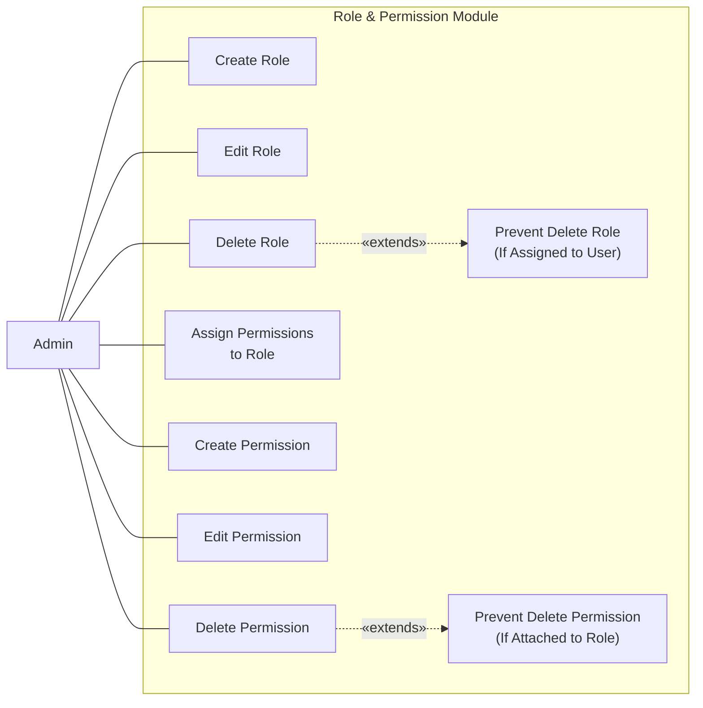

---

## 10. System Settings Module

Admin-only module for configuring system-wide settings.

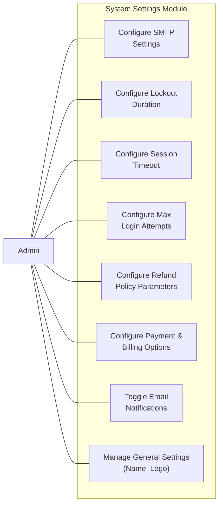

---

## 11. Audit Logs Module

Admin-only module for viewing the system audit trail.

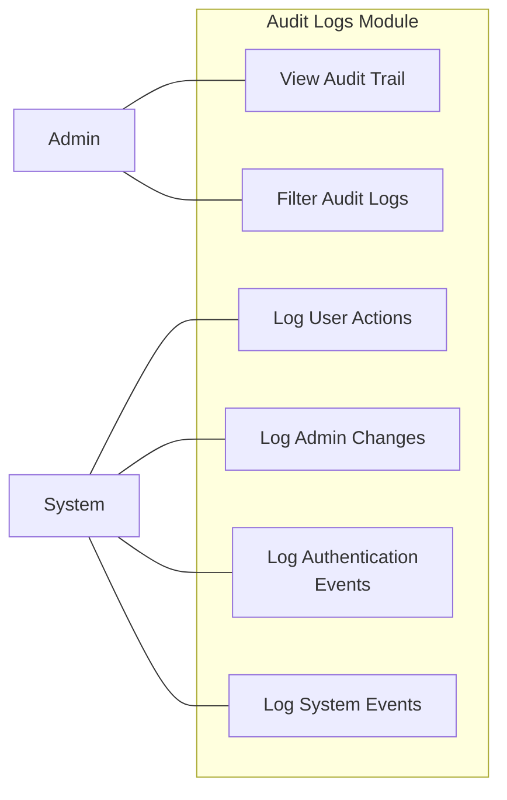

---

## 12. QR Code Door Access Module

Covers QR code generation, invalidation, and housekeeping workflow. Each QR code is scoped to a specific booking and homestay unit.

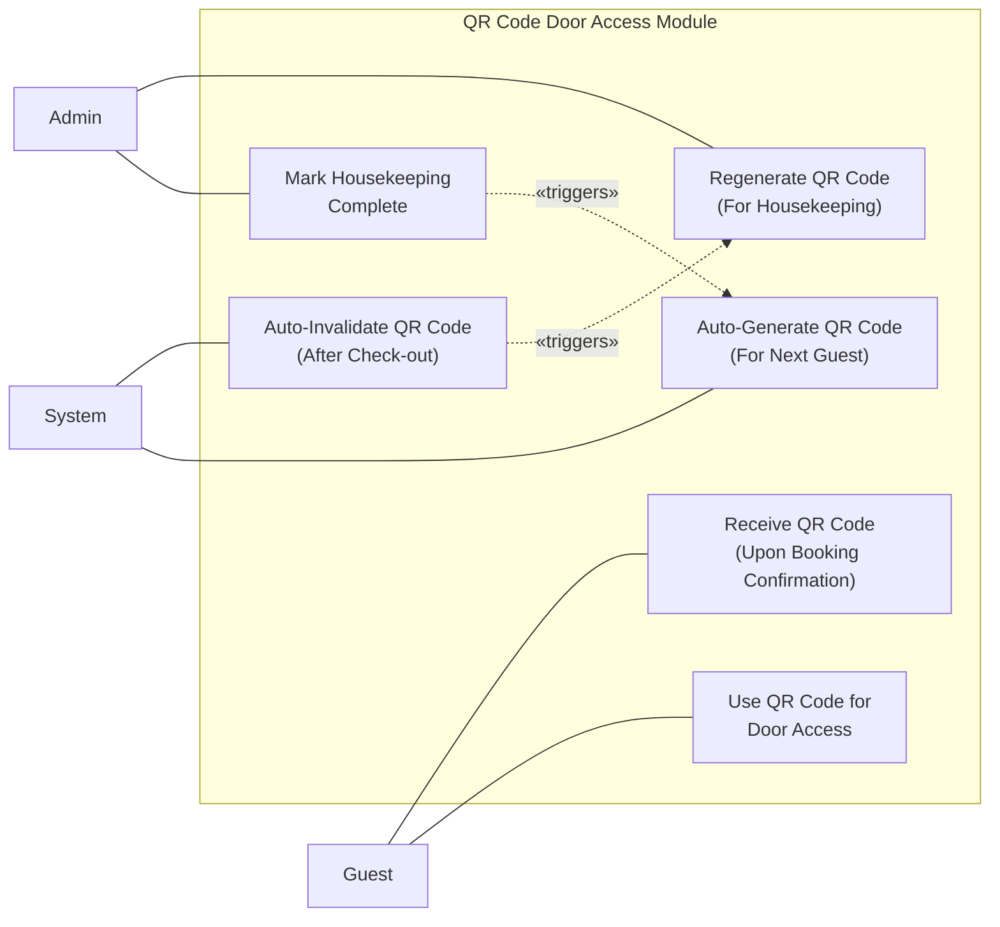

---

## Traceability Matrix

The following table maps each use case diagram back to its source requirements in the URS and PRD.

| Module | URS References | PRD References |
|---|---|---|
| Authentication | URS-U-AUTH-01 to 08, URS-A-AUTH-01 to 03 | AUTH-01 to 11 |
| Homestay Management | URS-U-BK-01, URS-A-HS-01 to 06 | HS-01 to 08 |
| Booking | URS-U-BK-02 to 10, URS-A-BK-01 to 07 | BK-U-01 to 08, BK-A-01 to 07, BK-H-01 to 03 |
| Payment | URS-U-PAY-01 to 06, URS-A-PAY-01 to 04 | PAY-U-01 to 05, PAY-A-01 to 05 |
| Notification | URS-U-NOTIF-01 to 03, URS-A-NOTIF-01 to 03 | NOTIF-01 to 07 |
| Chat | URS-U-CHAT-01, URS-A-CHAT-01 | CHAT-01 to 03 |
| User Management | URS-A-USR-01 to 04 | USR-01 to 06 |
| Role & Permission | URS-A-ROLE-01 to 03, URS-A-PERM-01 to 02 | ROLE-01 to 03, PERM-01 to 02 |
| System Settings | URS-A-SET-01 to 04 | SET-SMTP-01, SET-SEC-01 to 03, SET-GEN-01 to 04 |
| Audit Logs | URS-A-AUDIT-01 | AUDIT-01 to 03 |
| QR Code Door Access | URS-A-QR-01 to 03 | QR-01 to 06 |
