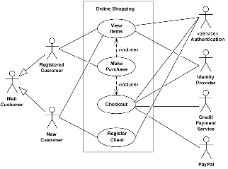
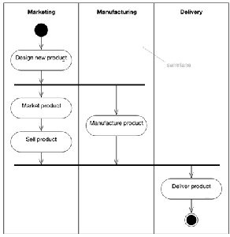
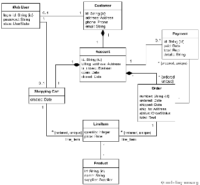
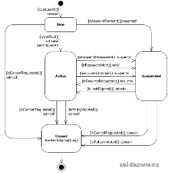
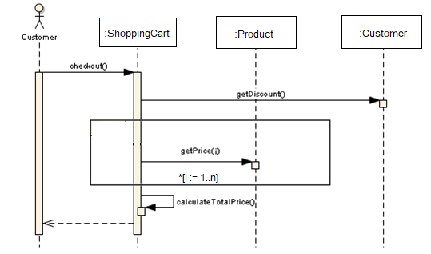

# Chapter 2: Specific Requirements (SRS) — Guideline (System Documentation)

This chapter is the **SRS** part of the SD. It should contain all software requirements at a level of detail sufficient for designers to build the system and testers to test it. Every stated requirement should be externally perceivable by users, operators or other external systems. At minimum, describe every input (stimulus) into the system, every output (response) from the system, and all functions performed in response to an input or in support of an output.

> Remove any italic notes/instructions from your final submission.

## 2.1 External Interface Requirements

### 2.1.1 User Interfaces
Specify:
1. The **logical characteristics** of each interface between the software and its users. This includes **configuration characteristics** (required screen formats, page/window layouts, content of reports or menus, availability of programmable function keys) needed to accomplish the requirements.
2. All aspects of **optimizing the interface** for the user. This can be a list of do's and don'ts on how the system appears to the user. Requirements should be verifiable, e.g. "A clerk typist grade 4 can do function X in Z minutes after 1 hour of training" rather than "a typist can do function X." (Ease of use can also be specified under Software System Attributes.)

### 2.1.2 Hardware Interfaces
Specify the logical characteristics of each interface between the software and the hardware components of the system. This includes configuration characteristics (number of ports, instruction sets, etc.), what devices are supported, how they are supported and the protocols. For example, terminal support may specify full-screen support versus line-by-line support.

### 2.1.3 Software Interfaces
Specify the use of other required software products (e.g. a data management system, an operating system, a mathematical package) and interfaces with other application systems (e.g. linkage between an accounts receivable system and a general ledger system). For each required software product provide:
- Name
- Mnemonic
- Specification number
- Version number
- Source

For each interface provide:
- Purpose of the interfacing software as related to this product.
- Definition of the interface in terms of message content and format (a reference to the document defining the interface is acceptable).

### 2.1.4 Communication Interfaces
Specify interfaces to communications such as local network protocols, etc.

## 2.2 System Features

Begin with a sentence like: *"The system features include…"*

Then include the **use case diagram** for the whole system.

**Figure 2.1: Use Case Diagram for \<Name of the System\>**
- Editable source (example): [diagrams/example_use_case_diagram.drawio.xml](diagrams/example_use_case_diagram.drawio.xml)

Include an **activity diagram** that describes the general sequence of actions across several objects/use cases, for functional modelling of the system as a whole.

**Figure 2.2: Activity Diagram for \<Name of the System\>**
- Editable source (example): [diagrams/example_activity_diagram.drawio.xml](diagrams/example_activity_diagram.drawio.xml)

Include the **domain model** (class diagram without the operations — only attributes, no visibility/type details). Explain each class, its attributes and the relationships between classes. For any class that has states, also include its **state machine diagram**.

**Figure 2.3: Domain Model for \<Name of the System\>**
- Editable source (example): [diagrams/example_domain_model_class_diagram.drawio.xml](diagrams/example_domain_model_class_diagram.drawio.xml)

**Figure 2.4: State Machine Diagram for \<Name of the Class\>**
- Editable source (example): [diagrams/example_state_machine_diagram.drawio.xml](diagrams/example_state_machine_diagram.drawio.xml)

As this is usually the largest and most important part of the SRS, apply these principles:
1. State specific requirements in conformance with the characteristics in IEEE Std 830-1998.
2. Cross-reference specific requirements to earlier related documents.
3. Make all requirements **uniquely identifiable** (give each functional requirement an ID).
4. Organize requirements to maximize readability.

For each functional requirement, give its details using a **use case description**, and include a **sequence diagram** for that use case. Combine alternate flows in the same sequence diagram; split only if too cluttered.

### 2.2.1 UC001: Use Case \<Name of Use Case 1\>
Give each use case a code (UC001, UC002, …). Use the description table below. Add alternative-flow rows as needed, or remove them if not used. Each use case must have a unique ID and its heading name must match the name in the use case diagram (Figure 2.1). Different scenarios of a use case need separate use case descriptions.

**Table 2.1: Use Case Description for \<Name of Use Case\>**

| Use case: \<Name of Use Case\> |
| ----- |
| **ID**: UCxxx |
| **Actors**: |
| **Preconditions**: |
| **Flow of events:** 1. 2. 3. … |
| **Postconditions:** |
| **Alternative flow *n*:** |
| **Postconditions:** |
| **Exception flow (if any):** |

Include the system sequence diagram (and activity diagram if useful) for each use case. Consider splitting different scenarios into different diagrams to avoid clutter.

**Figure 2.5: Sequence Diagram for \<Name of Use Case/Scenario\>**
- Editable source (example): [diagrams/example_sequence_diagram_checkout.drawio.xml](diagrams/example_sequence_diagram_checkout.drawio.xml)

### 2.2.2 UC002: Use Case \<Name of Use Case 2\>
### 2.2.3 UC003: Use Case \<Name of Use Case 3\>
### 2.2.*n* UC*n*: Use Case \<Name of Use Case *n*\>

(Repeat the use case description + sequence diagram pattern for each use case.)

## 2.3 Performance and Other Requirements
State and refer to the specific functional requirements related to performance non-functional requirements (if any). State other quality characteristics or non-functional requirements for users or developers, such as adaptability, flexibility, interoperability, maintainability, portability, reliability, reusability and usability.

## 2.4 Design Constraints
Explain any constraints imposed by the organization where the software will be used, e.g. adherence to an organizational standard and related non-functional requirements.

## 2.5 Software System Attributes
Indicate any specific attributes the users request, e.g. the system must be attractive and easy to use for specific users.
