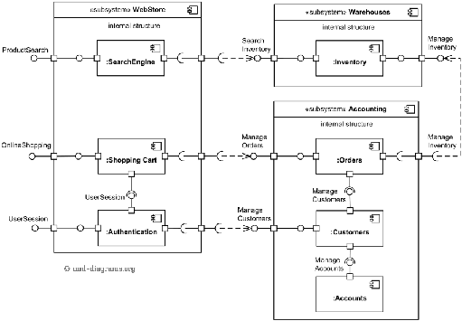

# Chapter 3: System Architectural Design (SDD) — Guideline (System Documentation)

This chapter is part of the **SDD**. It describes the architectural style with its rationale, and the component/subsystem structure.

> Remove any italic notes/instructions from your final submission.

## 3.1 Architecture Style and Rationale
State your chosen architectural style and the rationale for choosing that particular style.

## 3.2 Component Model
Develop a component model and explain how the components relate to achieve the complete functionality of the system. This is a high-level overview of how the system's responsibilities were partitioned and assigned to subsystems.

- Identify each high-level subsystem and the roles/responsibilities assigned to it.
- Describe how these subsystems collaborate to achieve the desired functionality.
- Do not go into too much detail on individual subsystems. The goal is a general understanding of how and why the system was decomposed, and how the parts work together.
- Provide a diagram showing the major subsystems, data repositories and their interconnections, then describe it clearly.

Include the **component diagram** here.

**Figure 3.1: Component Diagram of \<Name of the System\>**
- Editable source (example): [diagrams/example_component_diagram.drawio.xml](diagrams/example_component_diagram.drawio.xml)
