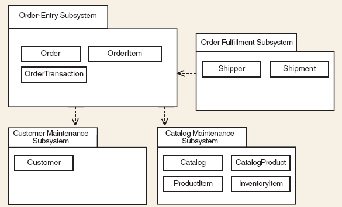
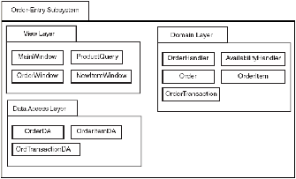
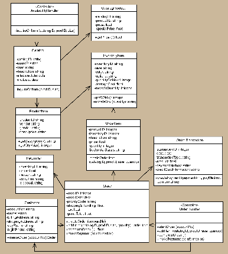
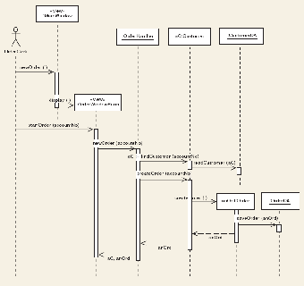
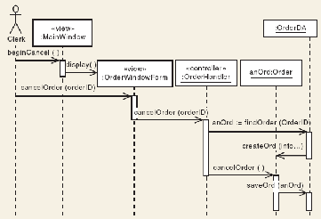

# Chapter 4: Detailed Description of Components (SDD) — Guideline (System Documentation)

This chapter is part of the **SDD**. It describes each module or subsystem in the project in detail.

> Remove any italic notes/instructions from your final submission.

## 4.1 Complete Package Diagram
Include the overall package diagram of your system. Indicate the navigation visibility based on the dependency among classes in the design class diagram. If the diagram is too cluttered, simplify by showing only class names (no attributes/methods). The details go in the per-subsystem class diagrams later.

**Figure 4.1: Package Diagram for \<Name of the System\>**
- Editable source (example): [diagrams/example_package_diagram_overall.drawio.xml](diagrams/example_package_diagram_overall.drawio.xml)

## 4.2 Detailed Description
For each subsystem/package there must be **one class diagram** and **several sequence diagrams** (one per use case in that subsystem/package). Use branching in a sequence diagram to combine alternate flows in the same diagram; if it gets cluttered, use a separate sequence diagram per scenario/alternate flow.

The example below uses view, domain and data access layers in respective packages. Organize subsystems/packages according to your chosen architectural style. If you choose MVC (or another style), the packages should follow that style. For the scope of this course you may follow the example.

### 4.2.1 P001: \<Name of Package 1\> Subsystem

**Figure 4.2: Package Diagram for \<Name of Package 1\> Subsystem**
- Editable source (example): [diagrams/example_package_diagram_subsystem.drawio.xml](diagrams/example_package_diagram_subsystem.drawio.xml)

#### 4.2.1.1 Class Diagram
Include a class diagram representing all classes in the subsystem/package, including the controller classes.

**Figure 4.3: Class Diagram for \<Name of Package 1\> Subsystem**
- Editable source (example): [diagrams/example_class_diagram_subsystem.drawio.xml](diagrams/example_class_diagram_subsystem.drawio.xml)

For each entity, list all methods in a table, then write the algorithm for each method. Add one table per entity.

| Entity Name | e.g. Order |
| :---- | :---- |
| **Method Name** | e.g. createOrder |
| **Input** |  |
| **Output** |  |
| **Algorithm** | Start … End |

Example algorithm format:
- Step 1: Start
- Step 2: Read/input A and B
- Step 3: If A greater than B then C = A
- Step 4: If B greater than A then C = B
- Step 5: Print C
- Step 6: End

#### 4.2.1.2 Sequence Diagram
Include a sequence diagram for each use case in the package. Each sequence diagram should comprise the view layer, controller, problem domain (entity) and data access layer. Give each scenario a unique code (SD001, SD002, …) to be used in Chapter 7 (Requirements Matrix). If a use case has only one scenario, one sequence diagram is enough.

**a) SD001: Sequence diagram for Create New Phone Order**

**Figure 4.4: Sequence Diagram for \<Create New Phone Order Scenario\>**
- Editable source (example): [diagrams/example_sequence_diagram_create_order.drawio.xml](diagrams/example_sequence_diagram_create_order.drawio.xml)

**b) SD002: Sequence diagram for Cancel an Order**

**Figure 4.5: Sequence Diagram for \<Cancel an Order Scenario\>**
- Editable source (example): [diagrams/example_sequence_diagram_cancel_order.drawio.xml](diagrams/example_sequence_diagram_cancel_order.drawio.xml)

### 4.2.2 P002: \<Name of Package 2\> Subsystem
#### 4.2.2.1 Class Diagram
#### 4.2.2.2 Sequence Diagram

### 4.2.3 P003: \<Name of Package *n*\> Subsystem
#### 4.2.3.1 Class Diagram
#### 4.2.3.2 Sequence Diagram

(Repeat the class diagram + sequence diagram pattern for every subsystem/package.)
