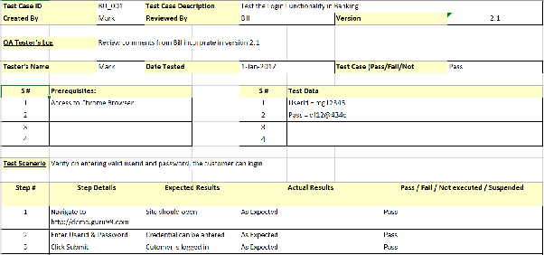

# Chapter 8: Test Cases (STD) + Appendix A — Guideline (System Documentation)

This chapter is the **STD** part of the SD. It is a numbered list of tests. Use tables to group similar tests.

> Remove any italic notes/instructions from your final submission.

For each test, specify:
- Test ID and name
- Additional description if the test name is not descriptive enough
- The input data
- The expected output data
- The actual output data *(out of scope for this course — leave blank)*
- Result: pass or fail *(out of scope for this course — leave blank)*

## 8.1 TC001: Test \<Name of Package 1\> Subsystem: \<Name of Use Case (UC001)\>
List all test cases first, then give the details for each, grouped under each package/subsystem and use case.

This test contains the following test cases:
1. TC001_01: Test \<Scenario of sequence diagram 1 (SD001)\>
2. TC001_02: Test \<Scenario of sequence diagram 2 (SD002)\>
3. …

### 8.1.1 TC001_01: Test \<scenario of sequence diagram 1 (SD001)\>
Provide the details for each test case using the test case template (the example below is an Excel-style form). For this course leave the actual-results and pass/fail columns blank. Include test cases for any **alternate and exception scenarios** under this sub-section too.

This test contains the following alternate and exception scenarios (if any):
1. TC001_01_01: Test \<alternate scenario 1 of sequence diagram 1 (SD001)\>
2. TC001_01_02: Test \<exception scenario 1 of sequence diagram 1 (SD001)\>
3. …

**Example test case template** — this is a form/spreadsheet layout, not a diagram, so it is kept as a reference image (no draw.io version). It captures: Test Case ID, Created By, Reviewed By, Version, QA Tester's Log, Tester's Name, Date Tested, Test Case Pass/Fail/Not executed, Prerequisites, Test Data, Test Scenario, and a step table (Step #, Step Details, Expected Results, Actual Results, Pass/Fail/Not executed/Suspended).

### 8.1.2 TC001_02: Test \<Scenario of sequence diagram 2 (SD002)\>
Provide the details for this test case.

### 8.1.3 TC001_*n*: Test \<Scenario of sequence diagram *n*\>
Provide the details for this test case.

## 8.2 TC002: Test \<Name of Package 2\> Subsystem: \<Name of Use Case (UC002)\>
List all test cases first, then provide details. Add sub-sections accordingly.

This test contains the following test cases:
1. TC002_01: Test \<Scenario of sequence diagram 4 (SD004)\>
2. TC002_02: Test \<Scenario of sequence diagram 5 (SD005)\>
3. …

## 8.3 TC003: Test \<Name of Package 3\> Subsystem: \<Name of Use Case (UC003)\>
List all test cases first, then provide details. Add sub-sections accordingly.

This test contains the following test cases:
1. TC003_01: Test \<Scenario of sequence diagram 6 (SD006)\>
2. TC003_02: Test \<Scenario of sequence diagram 7 (SD007)\>
3. …

---

# Appendix A: Traceability Matrix

Trace each test case back to its use case / sequence diagram and package.

| Test Case ID | Use Case ID / Sequence Diagram ID | Package ID |
| :---- | :---- | :---- |
| TC001 for \<Name of Package 1\> Subsystem TC001_01 TC001_02 | UC001 SD001 SD002 | P001 |
| TC002 for \<Name of Package 2\> Subsystem TC002_01 TC002_02 | UC002 SD004 SD005 | P001 |
| TC003 for \<Name of Package 3\> Subsystem TC003_01 TC003_02 | UC003 SD006 SD007 | P002 |
| … |  |  |
