# Activity Diagrams
## HomeLodge – Booking Homestay System

| Field | Detail |
|---|---|
| **Document Version** | 1.0 |
| **Status** | Draft |
| **Last Updated** | 2026-05-25 |
| **Reference** | UC_DESC v2.md, USE_CASE_DIAGRAMS.md |

> **Note:** Each activity diagram below corresponds to a use case from the Use Case Descriptions v2.0 document. Diagrams are rendered in Mermaid syntax and cover normal, alternative, and exception flows where applicable.

---

## Table of Contents

1. [Authentication Module](#1-authentication-module)
2. [Homestay Management Module](#2-homestay-management-module)
3. [Booking Module](#3-booking-module)
4. [Payment Module](#4-payment-module)
5. [Notification Module](#5-notification-module)
6. [Chat Module](#6-chat-module)
7. [User Management Module](#7-user-management-module)
8. [Role & Permission Module](#8-role--permission-module)
9. [System Settings Module](#9-system-settings-module)
10. [Audit Log Module](#10-audit-log-module)
11. [QR Code Door Access Module](#11-qr-code-door-access-module)
12. [Reporting & Analytics Module](#12-reporting--analytics-module)
13. [Guest Feedback Module](#13-guest-feedback-module)

---

## 1. Authentication Module

---

### UC-AUTH-01: Register Account (Email / Password)

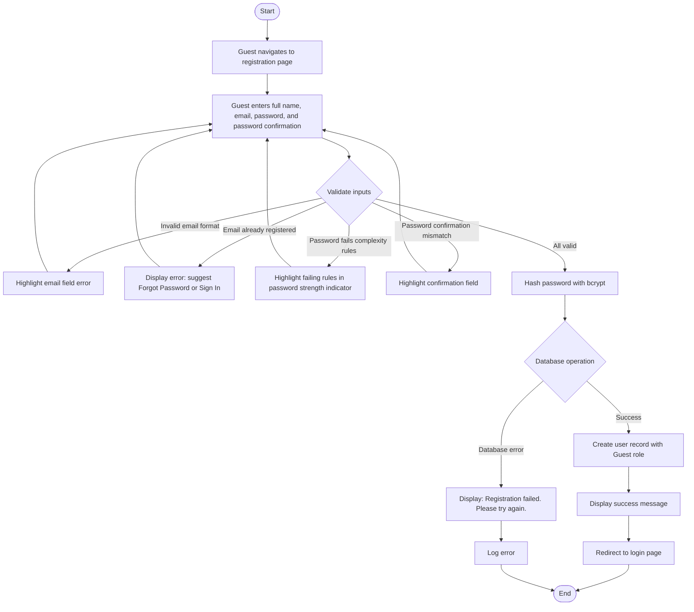

---

### UC-AUTH-02: Register / Login via Google SSO

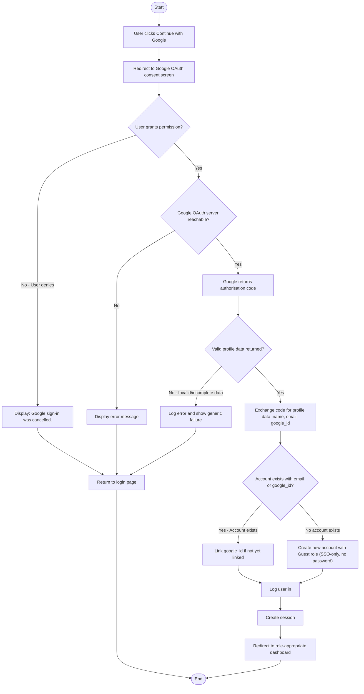

---

### UC-AUTH-03: Login

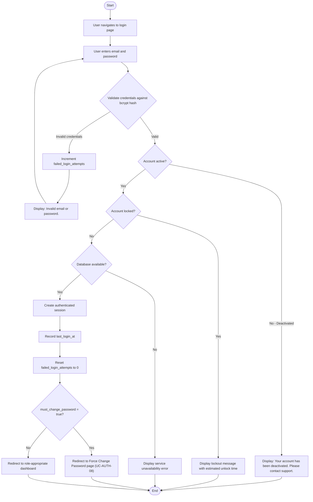

---

### UC-AUTH-04: Logout

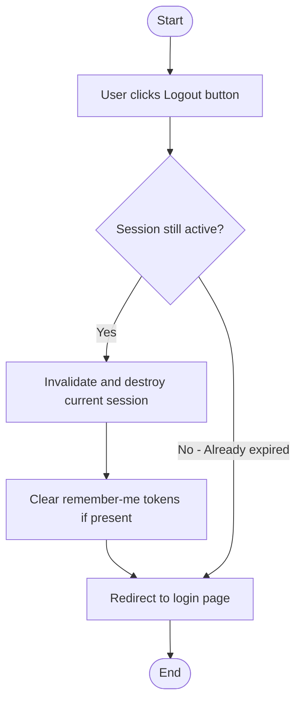

---

### UC-AUTH-05: Forgot Password (Reset via Email)

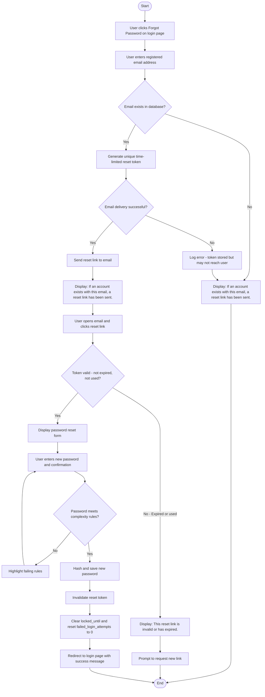

---

### UC-AUTH-06: View / Update Profile

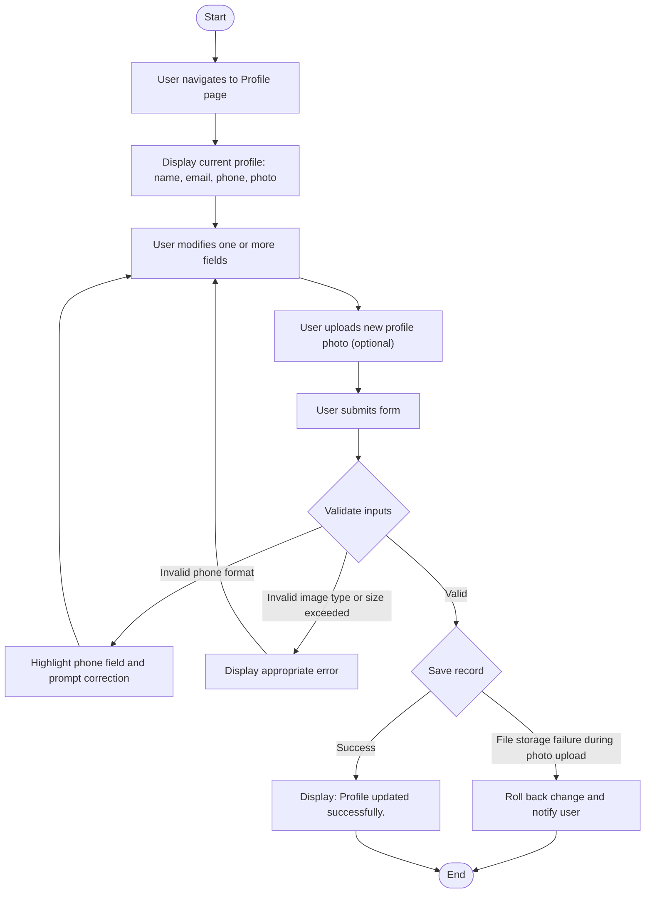

---

### UC-AUTH-07: Show / Hide Password Toggle

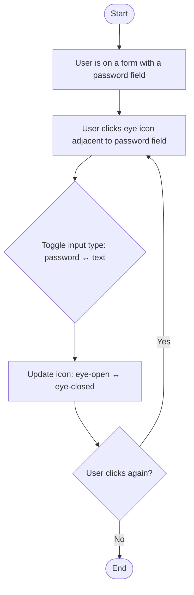

---

### UC-AUTH-08: Force Change Password (After Admin Reset)

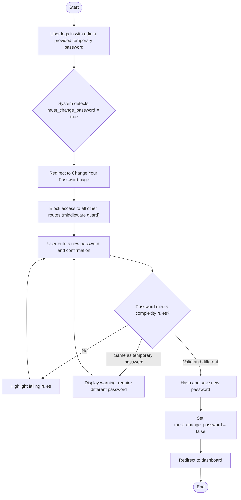

---

### UC-AUTH-09: Account Lockout (Exceeded Failed Attempts)

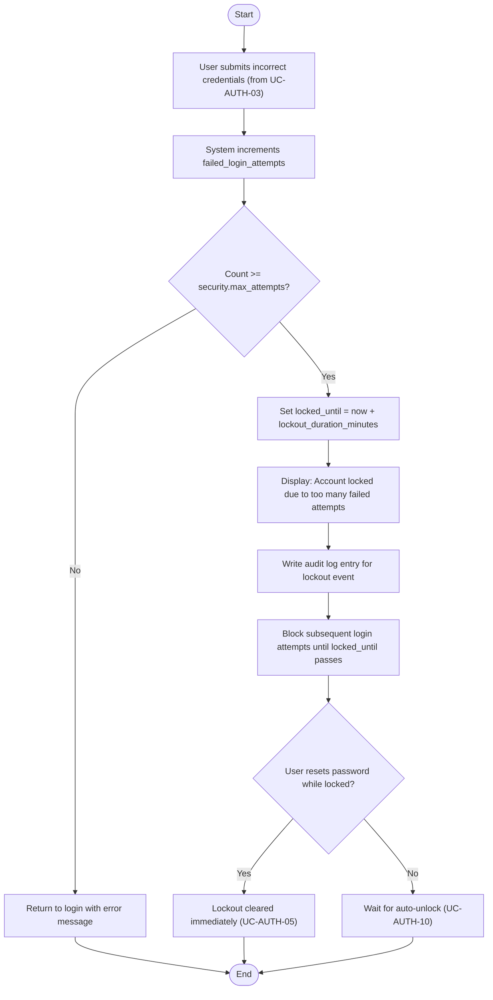

---

### UC-AUTH-10: Auto Unlock Account (After Lockout Duration)

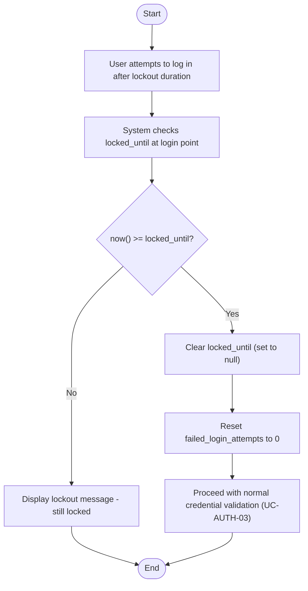

---

## 2. Homestay Management Module

---

### UC-HS-01: Browse Homestay Units

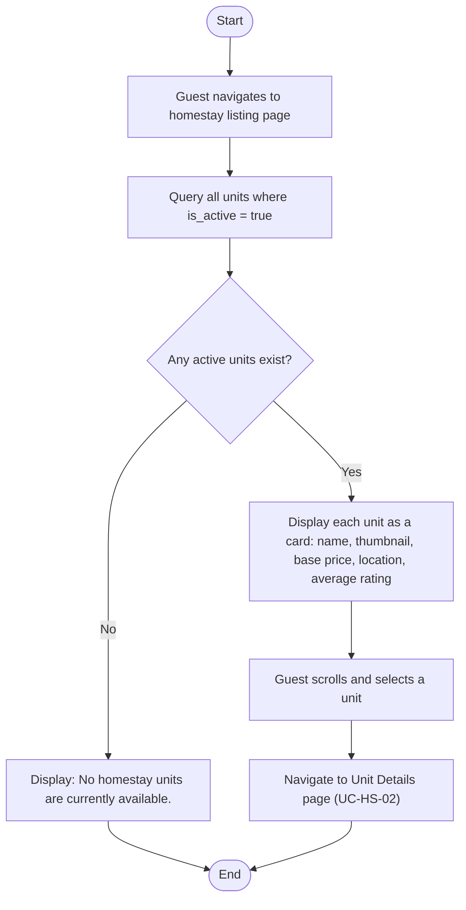

---

### UC-HS-02: View Unit Details & Availability

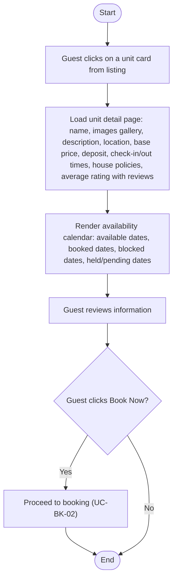

---

### UC-HS-03: View House Policies

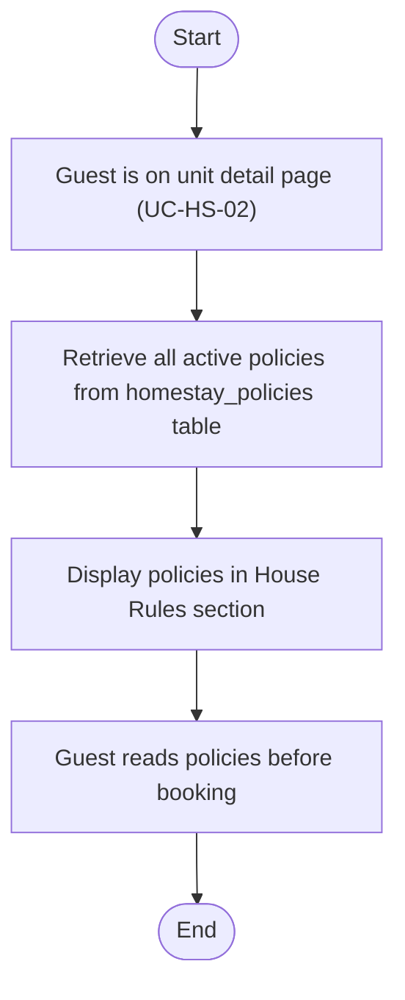

---

### UC-HS-04: Create Homestay Unit

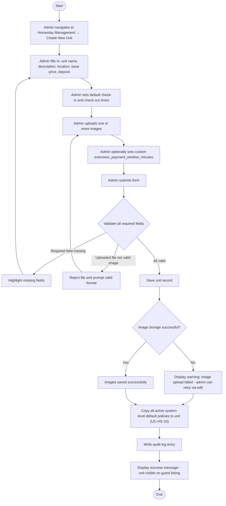

---

### UC-HS-05: Edit Homestay Unit

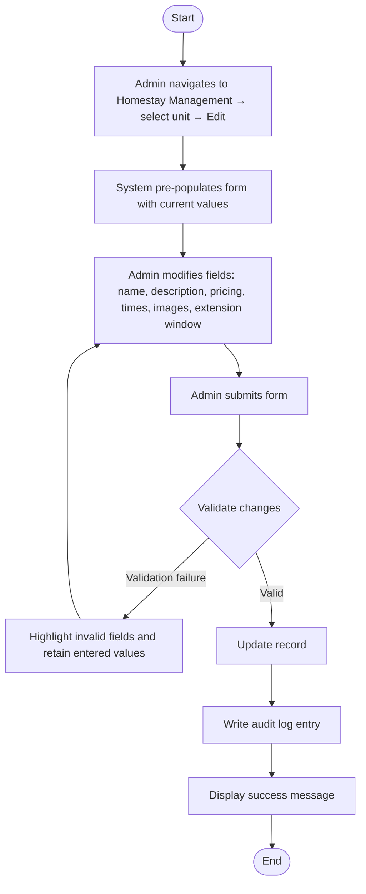

---

### UC-HS-06: Deactivate / Delete Homestay Unit

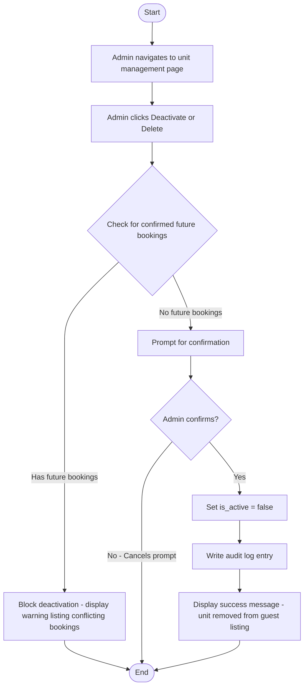

---

### UC-HS-07: View All Homestay Units (Admin)

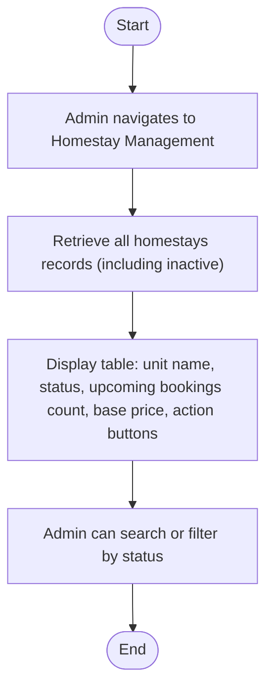

---

### UC-HS-08: Manage Unit House Policies

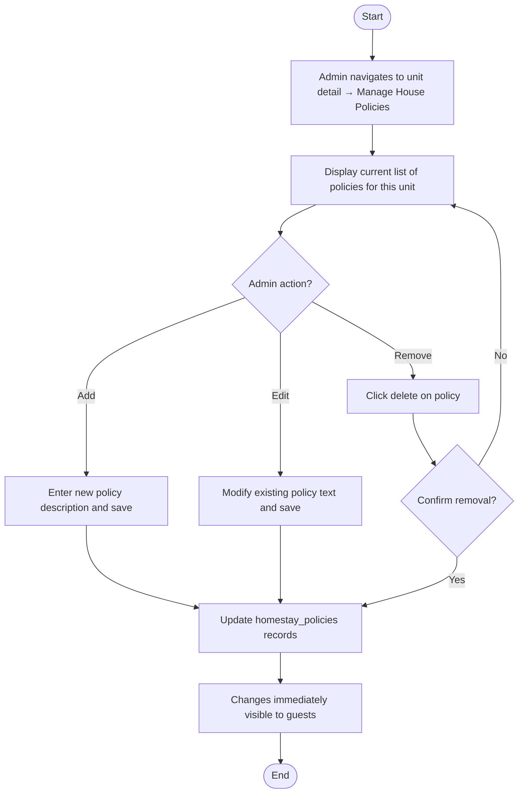

---

### UC-HS-09: Set Pricing & Check-in/out Times

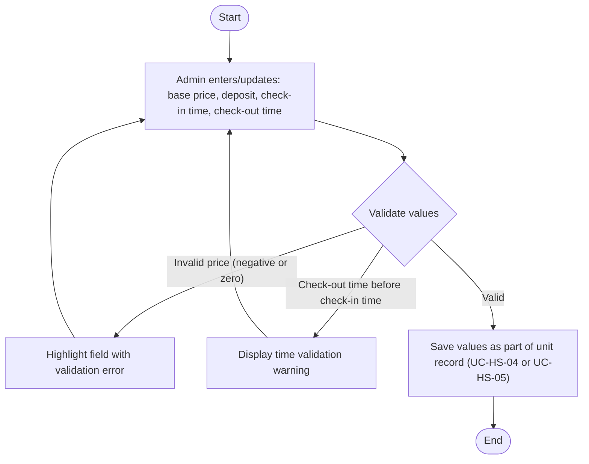

---

### UC-HS-10: Apply Default Policies on Unit Creation

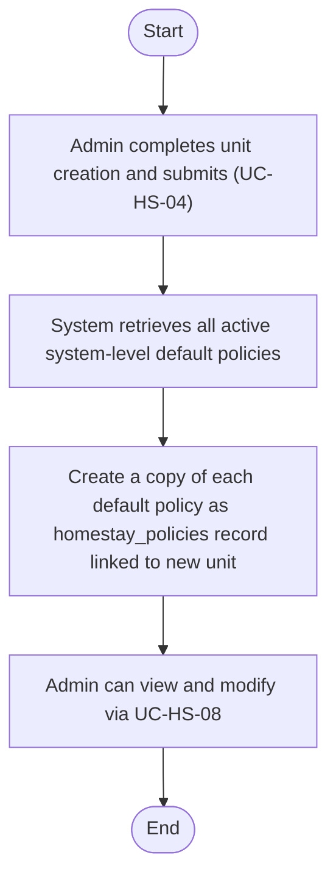

---

## 3. Booking Module

---

### UC-BK-01: View Availability Calendar

```mermaid
flowchart TD
    A([Start]) --> B[Guest is on unit detail page or booking form]
    B --> C["Query bookings, blocked_dates, and temporary holds for the unit"]
    C --> D["Render calendar with colour-coded dates"]
    D --> E["Green: Available to book"]
    D --> F["Red: Confirmed booking or admin-blocked"]
    D --> G["Yellow: Temporary hold - pending payment"]
    E & F & G --> H[Guest can navigate between months]
    H --> I([End])
```

---

### UC-BK-02: Select Check-in / Check-out Date & Time

```mermaid
flowchart TD
    A([Start]) --> B[Guest clicks a check-in date on availability calendar]
    B --> C[System highlights selected check-in date]
    C --> D[Guest clicks a check-out date]
    D --> E{"Check-out date before check-in date?"}
    E -->|Yes| F[Show validation error - prompt re-selection]
    F --> B
    E -->|No| G{"Trigger real-time availability check (UC-BK-03)"}
    G --> H{Dates available?}
    H -->|No - Includes unavailable date| I["Display: Selected dates are not available - highlight conflict"]
    I --> B
    H -->|Yes| J[Update booking summary with total nights and estimated cost]
    J --> K{"Single night minimum met?"}
    K -->|No| L[Show minimum stay requirement]
    L --> B
    K -->|Yes| M["Guest optionally adjusts check-in/check-out times"]
    M --> N([End])
```

---

### UC-BK-03: Check Date Availability (Real-time)

```mermaid
flowchart TD
    A([Start]) --> B["Receive unit ID, check-in date/time, check-out date/time"]
    B --> C{Database available?}
    C -->|No - Timeout| D["Return error: Unable to verify availability. Please try again."]
    D --> Z([End])
    C -->|Yes| E["Query bookings for unit with status confirmed or pending_payment that overlap requested range"]
    E --> F[Query blocked_dates for admin-blocked entries in range]
    F --> G{Any conflicts found?}
    G -->|No| H[Return availability confirmation]
    H --> Z
    G -->|Yes| I[Return unavailable with conflicting range details]
    I --> Z
```

---

### UC-BK-04: Submit Booking

```mermaid
flowchart TD
    A([Start]) --> B["Guest reviews booking summary: unit, dates, times, total cost including deposit"]
    B --> C["Guest clicks Confirm Booking"]
    C --> D{"Re-validate availability (prevent race conditions)"}
    D -->|Dates became unavailable| E[Display conflict message - guest must re-select]
    E --> Z([End])
    D -->|Available| F{Database operation successful?}
    F -->|No| G[Display error and allow retry]
    G --> Z
    F -->|Yes| H["Create bookings record: status = pending_payment, payment_deadline = now + 1 day"]
    H --> I["Auto-generate bill number and billing record (UC-PAY-06)"]
    I --> J["Send in-app and email notification with bill and payment deadline"]
    J --> K[Redirect guest to payment page]
    K --> Z
```

---

### UC-BK-05: Temporary Hold (1-Day Payment Window)

```mermaid
flowchart TD
    A([Start]) --> B["Booking created in pending_payment status (UC-BK-04)"]
    B --> C[Mark dates as held in availability queries]
    C --> D["Schedule auto-cancellation job if payment not received before payment_deadline (UC-BK-06)"]
    D --> E([End])
```

---

### UC-BK-06: Auto-Cancel Booking (Payment Timeout)

```mermaid
flowchart TD
    A([Start]) --> B["Scheduled job runs hourly (or configured interval)"]
    B --> C["Query all bookings: status = pending_payment AND payment_deadline < now"]
    C --> D{Any overdue bookings?}
    D -->|No| Z([End])
    D -->|Yes| E[For each overdue booking:]
    E --> F[Set status = cancelled]
    F --> G[Release held dates]
    G --> H["Send cancellation notification to guest (in-app and email)"]
    H --> I[Write audit log entry]
    I --> J{More overdue bookings?}
    J -->|Yes| E
    J -->|No| Z
```

---

### UC-BK-07: View Current Bookings (Guest)

```mermaid
flowchart TD
    A([Start]) --> B["Guest navigates to My Bookings"]
    B --> C["Retrieve bookings where status is confirmed or pending_payment"]
    C --> D["Display each booking: unit name, check-in/check-out dates, status badge, total cost"]
    D --> E{Guest clicks a booking?}
    E -->|Yes| F["View full details (UC-BK-09)"]
    F --> G([End])
    E -->|No| G
```

---

### UC-BK-08: View Booking History (Guest)

```mermaid
flowchart TD
    A([Start]) --> B["Guest navigates to My Bookings → History tab"]
    B --> C["Retrieve bookings where status is completed or cancelled"]
    C --> D["Display each booking: unit name, dates, status, amount paid"]
    D --> E{Booking status = completed?}
    E -->|Yes| F["Show action links: View Receipt, Leave a Review (if not yet submitted)"]
    E -->|No - Cancelled| G[Display without action links]
    F --> H([End])
    G --> H
```

---

### UC-BK-09: View Booking Details (Guest)

```mermaid
flowchart TD
    A([Start]) --> B[Guest clicks on a booking from their list]
    B --> C["Retrieve full booking record: unit, billing, QR code, extension records"]
    C --> D["Display: unit name & thumbnail, check-in/check-out, total amount, payment status, booking status"]
    D --> E{Status = confirmed?}
    E -->|Yes| F[Display QR code]
    E -->|No| G[QR code not shown]
    F --> H[Guest can download bill or receipt]
    G --> H
    H --> I([End])
```

---

### UC-BK-10: Cancel Booking (Guest)

```mermaid
flowchart TD
    A([Start]) --> B[Guest navigates to booking detail page]
    B --> C["Guest clicks Cancel Booking"]
    C --> D{Booking status?}
    D -->|pending_payment| E[No payment made - no refund needed]
    E --> F2[Display cancellation confirmation]
    D -->|confirmed| F["Calculate refund based on cancellation policy tiers (UC-BK-11)"]
    F --> G["Display confirmation dialog: refund amount, irreversible warning"]
    F2 --> H{Guest clicks Confirm Cancellation?}
    G --> H
    H -->|No - Cancels dialog| Z([End])
    H -->|Yes| I[Set booking status = cancelled and release dates]
    I --> J{Refund applicable?}
    J -->|Yes| K[Record refund and trigger refund via payment gateway]
    K --> L{Refund processing successful?}
    L -->|No| M["Flag refund as pending_manual - notify admin"]
    L -->|Yes| N[Refund processed]
    J -->|No| N
    M --> O["Send cancellation notifications (in-app and email) to guest and admin"]
    N --> O
    O --> P[Write audit log entry]
    P --> Z
```

---

### UC-BK-11: View Cancellation Policy & Refund Info

```mermaid
flowchart TD
    A([Start]) --> B[Retrieve current cancellation policy tiers from settings]
    B --> C[Calculate number of days until check-in]
    C --> D[Apply matching tier and compute refund amount]
    D --> E["Display: policy summary, days until check-in, refund percentage, exact refund amount"]
    E --> F([End])
```

---

### UC-BK-12: View Booking Calendar (Admin)

```mermaid
flowchart TD
    A([Start]) --> B[Admin navigates to Booking Calendar]
    B --> C[Retrieve all bookings and blocked dates across all units]
    C --> D["Render calendar (monthly/weekly view) with colour-coded entries per unit per status"]
    D --> E[Admin can filter by unit or status]
    E --> F{Admin clicks an entry?}
    F -->|Yes| G[View booking details or quick-edit]
    G --> H([End])
    F -->|No| H
```

---

### UC-BK-13: Create Booking on Behalf of User (Admin)

```mermaid
flowchart TD
    A([Start]) --> B["Admin navigates to Bookings → Create Booking"]
    B --> C[Admin selects target user account]
    C --> D[Admin selects homestay unit and desired check-in/check-out dates and times]
    D --> E{"Perform real-time availability check (UC-BK-03)"}
    E --> F{Dates available?}
    F -->|No| G[Display conflict - prompt admin to select different dates]
    G --> D
    F -->|Yes| H[Display booking summary and total cost]
    H --> I[Admin confirms booking]
    I --> J["Create booking record (pending_payment), auto-generate bill, notify guest to pay"]
    J --> K([End])
```

---

### UC-BK-14: Edit Booking (Admin)

```mermaid
flowchart TD
    A([Start]) --> B["Admin navigates to booking detail → clicks Edit"]
    B --> C[Admin modifies desired fields]
    C --> D{Dates changed?}
    D -->|Yes| E{"Check availability for new dates (UC-BK-03)"}
    E --> F{New dates available?}
    F -->|No| G[Block change and display conflict]
    G --> C
    F -->|Yes| H[Admin submits changes]
    D -->|No| H
    H --> I[Update record and write audit log entry]
    I --> J[Notify guest of the change]
    J --> K([End])
```

---

### UC-BK-15: Delete Booking (Admin)

```mermaid
flowchart TD
    A([Start]) --> B["Admin navigates to booking detail → clicks Delete"]
    B --> C["Display confirmation prompt: this is irreversible"]
    C --> D{Admin confirms?}
    D -->|No| Z([End])
    D -->|Yes| E[Delete booking record]
    E --> F[Release dates]
    F --> G[Notify guest]
    G --> H[Write audit log entry]
    H --> Z
```

---

### UC-BK-16: Cancel Booking on Behalf of User (Admin)

```mermaid
flowchart TD
    A([Start]) --> B["Admin opens booking detail → clicks Cancel Booking"]
    B --> C[Calculate and display refund amount per configured policy]
    C --> D{Admin confirms cancellation?}
    D -->|No| Z([End])
    D -->|Yes| E[Cancel booking and release dates]
    E --> F[Trigger refund if applicable]
    F --> G[Notify guest]
    G --> H([End])
```

---

### UC-BK-17: Filter Booking List (Admin)

```mermaid
flowchart TD
    A([Start]) --> B["Admin selects filter criteria: status, date range, unit, booking ID"]
    B --> C[Apply filters to bookings query]
    C --> D[Re-render booking list with matching results]
    D --> E{Admin clears filters?}
    E -->|Yes| F[Return to full list]
    F --> G([End])
    E -->|No| G
```

---

### UC-BK-18: Block Dates (Admin)

```mermaid
flowchart TD
    A([Start]) --> B[Admin navigates to Booking Calendar or unit management page]
    B --> C[Admin selects date range and target unit]
    C --> D{Selected dates have confirmed bookings?}
    D -->|Yes| E[Warn admin of conflict - must cancel existing bookings first]
    E --> Z([End])
    D -->|No| F["Admin enters internal reason/note (optional)"]
    F --> G["Admin clicks Block Dates"]
    G --> H[Create blocked_dates records for selected range and unit]
    H --> I[Dates immediately appear unavailable on guest-facing calendar]
    I --> Z
```

---

## 4. Payment Module

---

### UC-PAY-01: Make Payment (Online Gateway)

```mermaid
flowchart TD
    A([Start]) --> B["Guest clicks Pay Now from booking detail or bill view"]
    B --> C[Create payment request with gateway]
    C --> D[Redirect guest to payment page]
    D --> E{Guest completes payment?}
    E -->|No - Abandons page| F["No webhook received - booking remains pending_payment until deadline"]
    F --> Z([End])
    E -->|Yes| G["Gateway processes payment"]
    G --> H{"Gateway sends webhook (UC-PAY-05)"}
    H --> I{Payment successful?}
    I -->|No - Declined/failed| J["Update payments record to failed"]
    J --> K["Redirect guest with error and Try Again option"]
    K --> Z
    I -->|Yes| L[Verify webhook signature]
    L --> M[Update payments record to succeeded]
    M --> N[Update booking status to confirmed]
    N --> O["Generate guest QR code (UC-QR-01)"]
    O --> P[Generate payment receipt]
    P --> Q["Send booking confirmation notification (in-app and email) with receipt and QR code"]
    Q --> R[Notify admin of new confirmed booking]
    R --> Z
```

---

### UC-PAY-02: View Payment Bill

```mermaid
flowchart TD
    A([Start]) --> B[Guest navigates to booking detail or clicks bill link in notification]
    B --> C[Retrieve associated billing record]
    C --> D["Render bill: bill number, booking reference, unit name, dates, nightly rate, number of nights, deposit, total amount, payment deadline"]
    D --> E{"Guest clicks Download PDF?"}
    E -->|Yes| F[Generate and download bill PDF]
    F --> G([End])
    E -->|No| G
```

---

### UC-PAY-03: View / Download Payment Receipt

```mermaid
flowchart TD
    A([Start]) --> B[Guest navigates to booking detail or payment history]
    B --> C["Guest clicks View Receipt or Download Receipt"]
    C --> D["Retrieve or regenerate receipt PDF via barryvdh/laravel-dompdf"]
    D --> E[Deliver PDF to guest browser for viewing or download]
    E --> F([End])
```

---

### UC-PAY-04: View Payment History (Guest)

```mermaid
flowchart TD
    A([Start]) --> B["Guest navigates to Payment History"]
    B --> C[Retrieve all payments records for logged-in user]
    C --> D["Display each payment: payment number, booking reference, date, amount, status"]
    D --> E["Guest applies optional filters (date range, status)"]
    E --> F[Re-query and update list]
    F --> G{Guest clicks an entry?}
    G -->|Yes| H[View corresponding bill or receipt]
    H --> I([End])
    G -->|No| I
```

---

### UC-PAY-05: Process Payment Webhook

```mermaid
flowchart TD
    A([Start]) --> B["Gateway sends POST to /webhook/payment with payload and signature"]
    B --> C{Validate HMAC/signature against gateway secret}
    C -->|Fails| D["Return HTTP 400 - log security warning"]
    D --> Z([End])
    C -->|Valid| E[Extract payment reference and look up payments record]
    E --> F{Payment record found?}
    F -->|No| G["Return HTTP 404 - log event"]
    G --> Z
    F -->|Yes| H{Check idempotency key - already processed?}
    H -->|Yes - Duplicate| I[Discard without re-processing]
    I --> J[Return HTTP 200]
    J --> Z
    H -->|No - New| K["Update payment status (succeeded / failed / pending)"]
    K --> L{Status = succeeded?}
    L -->|Yes| M["Trigger booking confirmation, QR generation, receipt creation"]
    L -->|No| N[Record status only]
    M --> O[Return HTTP 200]
    N --> O
    O --> P[Write audit log entry]
    P --> Z
```

---

### UC-PAY-06: Auto-Generate Bill & Payment Number

```mermaid
flowchart TD
    A([Start]) --> B[System detects new billing or payments record being inserted]
    B --> C["Generate formatted reference number (e.g., BILL-2026-0001, PAY-2026-0001)"]
    C --> D[Assign number to record before saving]
    D --> E([End])
```

---

### UC-PAY-07: View Billing List (Admin)

```mermaid
flowchart TD
    A([Start]) --> B["Admin navigates to Payment Management → Billing List"]
    B --> C[Retrieve all billing records]
    C --> D["Display: bill number, booking reference, guest name, unit, amount, status, date generated"]
    D --> E["Admin applies filters (bill number search, date range)"]
    E --> F{Admin clicks a bill?}
    F -->|Yes| G["View details or regenerate (UC-PAY-09)"]
    G --> H([End])
    F -->|No| H
```

---

### UC-PAY-08: View Payment List (Admin)

```mermaid
flowchart TD
    A([Start]) --> B["Admin navigates to Payment Management → Payment List"]
    B --> C[Retrieve all payments records]
    C --> D["Display: payment number, related bill, guest, amount, status, date"]
    D --> E[Admin applies filters]
    E --> F{Admin clicks a payment?}
    F -->|Yes| G[View receipt or details]
    G --> H([End])
    F -->|No| H
```

---

### UC-PAY-09: Regenerate Bill / Receipt (Admin)

```mermaid
flowchart TD
    A([Start]) --> B[Admin navigates to billing or payment detail page]
    B --> C["Admin clicks Regenerate Bill or Regenerate Receipt"]
    C --> D["Re-render document using latest data via barryvdh/laravel-dompdf"]
    D --> E[Make new PDF available for download]
    E --> F[Optionally resend to guest via email]
    F --> G([End])
```

---

## 5. Notification Module

---

### UC-NOTIF-01: Receive In-App Notification

```mermaid
flowchart TD
    A([Start]) --> B["Triggering event occurs (e.g., booking confirmed, payment received)"]
    B --> C[Create notifications record for target user]
    C --> D["Broadcast notification event via Laravel Reverb (WebSocket)"]
    D --> E{User currently online?}
    E -->|Yes| F[Bell icon badge increments in real time]
    E -->|No| G[Notification stored for next login]
    F --> H[User clicks bell icon]
    H --> I["Display notifications list (read and unread) in reverse chronological order"]
    I --> J{User clicks a notification?}
    J -->|Yes| K["Mark as read and navigate to relevant entity"]
    J -->|No| L([End])
    K --> L
    G --> L
```

---

### UC-NOTIF-02: Receive Email Notification

```mermaid
flowchart TD
    A([Start]) --> B["Triggering event occurs (booking confirmation, payment receipt, cancellation, etc.)"]
    B --> C{notification.email_enabled = true?}
    C -->|No - Globally disabled| D[Skip email sending - in-app notification still created]
    D --> Z([End])
    C -->|Yes| E[Queue email notification job via Laravel Queues]
    E --> F{SMTP server reachable?}
    F -->|No| G[Email job fails - system retries per queue config]
    G --> H{Max retries reached?}
    H -->|Yes| I[Log failure - no in-app notification impact]
    I --> Z
    H -->|No| F
    F -->|Yes| J[Dispatch email via configured SMTP server]
    J --> K["Email arrives in recipient inbox"]
    K --> Z
```

---

### UC-NOTIF-03: Receive Payment Reminder

```mermaid
flowchart TD
    A([Start]) --> B["Scheduled job runs daily (or configured interval)"]
    B --> C["Query bookings: status = pending_payment AND payment_deadline within next N hours"]
    C --> D{Any matching bookings?}
    D -->|No| Z([End])
    D -->|Yes| E[For each matching booking:]
    E --> F["Send in-app notification and email to guest"]
    F --> G["Include: booking reference, amount due, payment deadline, direct payment link"]
    G --> H{More matching bookings?}
    H -->|Yes| E
    H -->|No| Z
```

---

### UC-NOTIF-04: Receive Check-in / Check-out Reminder

```mermaid
flowchart TD
    A([Start]) --> B[Scheduled daily job runs]
    B --> C[Query confirmed bookings where check-in or check-out is within reminder window]
    C --> D{Any matching bookings?}
    D -->|No| Z([End])
    D -->|Yes| E["Send check-in reminder to guest: unit name, check-in date/time, QR code reminder"]
    E --> F["Send check-in/check-out reminders to admin for operational readiness (includes UC-NOTIF-05)"]
    F --> Z
```

---

### UC-NOTIF-05: Receive QR Code Reminder (Admin)

```mermaid
flowchart TD
    A([Start]) --> B["Scheduled daily job runs (same job as UC-NOTIF-04)"]
    B --> C[Identify confirmed bookings with approaching check-in/check-out]
    C --> D["Send admin in-app and email notification: Upcoming check-in for Guest at Unit on Date. Please verify QR code status."]
    D --> E([End])
```

---

### UC-NOTIF-06: View Booking in Google Calendar

```mermaid
flowchart TD
    A([Start]) --> B[System detects booking status change to confirmed]
    B --> C{User has connected Google account?}
    C -->|No| D[Skip calendar sync - no error shown]
    D --> Z([End])
    C -->|Yes| E["Retrieve user stored Google OAuth token"]
    E --> F{Google API accessible and token valid?}
    F -->|No - API error or token expired| G[Log failure - user may need to reconnect]
    G --> Z
    F -->|Yes| H{"Call Google Calendar API to create event: title, start, end, description"}
    H --> I{Event already exists?}
    I -->|Yes| J[Update existing event]
    I -->|No| K[Create new event]
    J --> L["Event appears in user Google Calendar"]
    K --> L
    L --> Z
```

---

### UC-NOTIF-07: Toggle Email Notifications (Admin)

```mermaid
flowchart TD
    A([Start]) --> B["Admin navigates to System Settings → Notification Settings"]
    B --> C["Admin toggles Email Notifications switch"]
    C --> D["Save notification.email_enabled = true/false"]
    D --> E[Display success message]
    E --> F[Future email jobs check this flag before sending]
    F --> G([End])
```

---

## 6. Chat Module

---

### UC-CHAT-01: Send Message

```mermaid
flowchart TD
    A([Start]) --> B[User navigates to Chat page]
    B --> C[User types message in text input]
    C --> D{Message empty?}
    D -->|Yes| E["Submit button disabled - no action"]
    E --> C
    D -->|No| F["User clicks Send or presses Enter"]
    F --> G["Save message to chat_messages: sender ID, recipient ID, content, timestamp"]
    G --> H{WebSocket connection active?}
    H -->|Yes| I["Broadcast message via Laravel Reverb on chat channel"]
    I --> J["Recipient receives message in real time (UC-CHAT-02)"]
    H -->|No| K["Display Reconnecting... indicator - message saved to database"]
    J --> L["Message appears in sender chat window as sent"]
    K --> L
    L --> M([End])
```

---

### UC-CHAT-02: Receive Message (Real-time)

```mermaid
flowchart TD
    A([Start]) --> B["Sender sends message (UC-CHAT-01)"]
    B --> C["Laravel Reverb broadcasts event on recipient private channel"]
    C --> D{Recipient currently online?}
    D -->|No| E[Message stored in database - visible on next login]
    E --> Z([End])
    D -->|Yes| F["Laravel Echo on recipient browser receives event"]
    F --> G[Append new message to chat window]
    G --> H{Chat window in focus?}
    H -->|Yes| I[Message displayed immediately]
    H -->|No| J[Unread badge on chat icon increments]
    I --> Z
    J --> Z
```

---

### UC-CHAT-03: View Chat History

```mermaid
flowchart TD
    A([Start]) --> B[User navigates to Chat page]
    B --> C["Retrieve all chat_messages for conversation (ordered by created_at ascending)"]
    C --> D["Render message thread: sender name, content, timestamp"]
    D --> E["Current user messages aligned right - received messages aligned left"]
    E --> F[Mark all unread messages as read]
    F --> G[Auto-scroll to latest message]
    G --> H([End])
```

---

## 7. User Management Module

---

### UC-USR-01: Create User Account (Admin)

```mermaid
flowchart TD
    A([Start]) --> B["Admin navigates to User Management → Create User"]
    B --> C["Admin enters: full name, email, assigns a role"]
    C --> D{Email already registered?}
    D -->|Yes| E[Display validation error - admin can edit existing account]
    E --> C
    D -->|No| F["Generate default temporary password (Abc@123 or configurable)"]
    F --> G["Create user record with must_change_password = true"]
    G --> H[Send user email with temporary password and login link]
    H --> I[Write audit log entry]
    I --> J[Display success message]
    J --> K([End])
```

---

### UC-USR-02: Edit User Account (Admin)

```mermaid
flowchart TD
    A([Start]) --> B["Admin navigates to User Management → select user → Edit"]
    B --> C[Pre-populate edit form with current values]
    C --> D[Admin updates desired fields]
    D --> E[Admin submits form]
    E --> F{"Validate changes (e.g., email uniqueness)"}
    F -->|Invalid| G[Display validation error]
    G --> D
    F -->|Valid| H[Save updated record]
    H --> I[Write audit log entry]
    I --> J[Display success message]
    J --> K([End])
```

---

### UC-USR-03: Delete User Account (Admin)

```mermaid
flowchart TD
    A([Start]) --> B["Admin navigates to User Management → select user → Delete"]
    B --> C{Check for active or upcoming bookings?}
    C -->|Yes - Has bookings| D["Display warning: This user has N active/upcoming bookings"]
    D --> E{Admin confirms deletion?}
    C -->|No bookings| E2[Display secondary confirmation prompt]
    E2 --> E
    E -->|No - Cancels| Z([End])
    E -->|Yes| F[Soft-delete or remove user record]
    F --> G[Write audit log entry]
    G --> Z
```

---

### UC-USR-04: Reset User Password (Admin)

```mermaid
flowchart TD
    A([Start]) --> B["Admin navigates to User Management → select user → Reset Password"]
    B --> C{Choose reset method}
    C -->|Option A: Send reset link| D[Send password reset email to user registered address]
    C -->|Option B: Set to default| E["Set password to Abc@123 immediately"]
    D --> F["Set must_change_password = true"]
    E --> F
    F --> G["Clear locked_until and reset failed_login_attempts to 0"]
    G --> H["Notify user (in-app and email)"]
    H --> I[Write audit log entry]
    I --> J([End])
```

---

### UC-USR-05: Activate / Deactivate User Account (Admin)

```mermaid
flowchart TD
    A([Start]) --> B["Admin navigates to User Management → select user → Deactivate or Activate"]
    B --> C[System prompts for confirmation]
    C --> D{Admin confirms?}
    D -->|No| Z([End])
    D -->|Yes| E[Update is_active flag]
    E --> F{Deactivating?}
    F -->|Yes| G[Invalidate any existing sessions for this user]
    G --> H[Display success message]
    F -->|No - Activating| H
    H --> I[Write audit log entry]
    I --> Z
```

---

### UC-USR-06: Force Password Change (Triggered by Admin Reset)

```mermaid
flowchart TD
    A([Start]) --> B["Admin completes password reset (UC-USR-04)"]
    B --> C["System sets must_change_password = true on user record"]
    C --> D["On user next login: system enforces change (UC-AUTH-08)"]
    D --> E([End])
```

---

## 8. Role & Permission Module

---

### UC-ROLE-01: Create Role

```mermaid
flowchart TD
    A([Start]) --> B["Admin navigates to Role Management → Create Role"]
    B --> C[Admin enters role name and optional description]
    C --> D{Role name unique?}
    D -->|No| E[Display validation error]
    E --> C
    D -->|Yes| F[Create role record via spatie/laravel-permission]
    F --> G["Navigate to role detail page to assign permissions (UC-ROLE-04)"]
    G --> H([End])
```

---

### UC-ROLE-02: Edit Role

```mermaid
flowchart TD
    A([Start]) --> B["Admin selects a role and clicks Edit"]
    B --> C[Admin modifies name or description]
    C --> D{New name unique?}
    D -->|No| E[Display validation error]
    E --> C
    D -->|Yes| F[Save updated role]
    F --> G([End])
```

---

### UC-ROLE-03: Delete Role

```mermaid
flowchart TD
    A([Start]) --> B["Admin selects a role and clicks Delete"]
    B --> C{Any users currently assigned this role?}
    C -->|Yes| D["Block deletion: This role is assigned to N user(s). Reassign users before deleting."]
    D --> Z([End])
    C -->|No| E[Prompt for confirmation]
    E --> F{Admin confirms?}
    F -->|No| Z
    F -->|Yes| G[Delete role]
    G --> H[Write audit log entry]
    H --> Z
```

---

### UC-ROLE-04: Assign Permissions to Role

```mermaid
flowchart TD
    A([Start]) --> B["Admin navigates to Role Management → select role → Manage Permissions"]
    B --> C["Display checklist of all available permissions (currently assigned ones checked)"]
    C --> D[Admin checks or unchecks permissions]
    D --> E[Admin saves changes]
    E --> F["Sync role permissions via Spatie syncPermissions method"]
    F --> G[Write audit log entry]
    G --> H([End])
```

---

### UC-ROLE-05: Create Permission

```mermaid
flowchart TD
    A([Start]) --> B["Admin navigates to Permission Management → Create Permission"]
    B --> C["Admin enters permission name (e.g., booking.create) and optional description"]
    C --> D{Permission name unique?}
    D -->|No| E[Display validation error]
    E --> C
    D -->|Yes| F[Create permission record via Spatie Permission]
    F --> G([End])
```

---

### UC-ROLE-06: Edit Permission

```mermaid
flowchart TD
    A([Start]) --> B["Admin selects a permission and clicks Edit"]
    B --> C[Admin modifies name or description]
    C --> D[System saves the update]
    D --> E([End])
```

---

### UC-ROLE-07: Delete Permission

```mermaid
flowchart TD
    A([Start]) --> B["Admin selects a permission and clicks Delete"]
    B --> C{Permission attached to any roles?}
    C -->|Yes| D["Block deletion: This permission is attached to N role(s). Remove from roles before deleting."]
    D --> Z([End])
    C -->|No| E[Prompt for confirmation]
    E --> F{Admin confirms?}
    F -->|No| Z
    F -->|Yes| G[Delete permission]
    G --> H[Write audit log entry]
    H --> Z
```

---

## 9. System Settings Module

---

### UC-SET-01: Configure SMTP Settings

```mermaid
flowchart TD
    A([Start]) --> B["Admin navigates to System Settings → Email (SMTP)"]
    B --> C["Admin enters: SMTP host, port, username, password, encryption, sender name, sender email"]
    C --> D{"Admin clicks Test Connection? (optional)"}
    D -->|Yes| E{Test connection successful?}
    E -->|No| F[Display SMTP error message]
    F --> C
    E -->|Yes| G[Connection verified]
    D -->|No - Skip test| G
    G --> H[Admin saves settings]
    H --> I[Store values in settings table]
    I --> J([End])
```

---

### UC-SET-02: Configure Security Settings

```mermaid
flowchart TD
    A([Start]) --> B["Admin navigates to System Settings → Security"]
    B --> C["Admin sets: max login attempts, lockout duration (minutes), session timeout (minutes)"]
    C --> D{Values are positive integers?}
    D -->|No| E[Display validation error]
    E --> C
    D -->|Yes| F[Save values to settings table]
    F --> G[Display success confirmation]
    G --> H([End])
```

---

### UC-SET-03: Configure Refund Policy Parameters

```mermaid
flowchart TD
    A([Start]) --> B["Admin navigates to System Settings → Refund Policy"]
    B --> C["View current tiered configuration (e.g., >14 days: 100%, 7-14 days: 50%, <7 days: 0%)"]
    C --> D[Admin modifies tier thresholds and/or percentages]
    D --> E[Admin saves]
    E --> F{Validate tiers}
    F -->|Tiers overlap or percentages out of 0-100 range| G[Display validation error]
    G --> D
    F -->|Valid| H[Save tiers to settings]
    H --> I([End])
```

---

### UC-SET-04: Configure Payment & Billing Options

```mermaid
flowchart TD
    A([Start]) --> B["Admin navigates to System Settings → Payment & Billing"]
    B --> C["Admin configures: gateway API key/secret, bill number prefix, payment window duration, deposit config"]
    C --> D[Admin saves settings]
    D --> E{Validate configuration}
    E -->|Invalid| F[Display validation error]
    F --> C
    E -->|Valid| G[Save to settings]
    G --> H([End])
```

---

### UC-SET-05: Toggle Email Notifications Globally

> See UC-NOTIF-07 for full activity diagram. This setting is accessible from System Settings → Notification Settings.

---

### UC-SET-06: Configure Extension Charge Rates

```mermaid
flowchart TD
    A([Start]) --> B["Admin navigates to System Settings → Extension Settings"]
    B --> C["Admin enters: charge rate per hour (time extensions), charge rate per night (date extensions)"]
    C --> D{Values are positive numeric amounts?}
    D -->|No| E[Display validation error]
    E --> C
    D -->|Yes| F[Save values to settings]
    F --> G[Display confirmation message]
    G --> H([End])
```

---

### UC-SET-07: Configure System-Wide Default Extension Payment Window

```mermaid
flowchart TD
    A([Start]) --> B["Admin navigates to System Settings → Extension Settings"]
    B --> C["Admin sets payment window duration in minutes (default: 60)"]
    C --> D{Value is a positive integer?}
    D -->|No| E[Display validation error]
    E --> C
    D -->|Yes| F[Save to settings]
    F --> G([End])
```

---

### UC-SET-08: Manage Default Homestay Policies

```mermaid
flowchart TD
    A([Start]) --> B["Admin navigates to System Settings → Default Policies"]
    B --> C["Display current default policies (seeded: No Pets, No Durians, No Smoking)"]
    C --> D{Admin action?}
    D -->|Add| E[Enter new default policy description]
    E --> F[Save changes]
    D -->|Edit| G[Modify existing default policy text]
    G --> F
    D -->|Remove| H["Delete a default policy (with confirmation)"]
    H --> I{Admin confirms?}
    I -->|Yes| F
    I -->|No| C
    F --> J[Future unit creations will apply updated defaults]
    J --> K([End])
```

---

### UC-SET-09: Configure Per-Unit Extension Payment Window

```mermaid
flowchart TD
    A([Start]) --> B["Admin is on homestay unit create/edit page"]
    B --> C["Admin enters value in minutes in Extension Payment Window field"]
    C --> D{Value provided?}
    D -->|No - Left blank| E[System default will be used]
    D -->|Yes| F["Save value to homestays.extension_payment_window_minutes"]
    E --> G[Extension billing for this unit uses appropriate window]
    F --> G
    G --> H([End])
```

---

## 10. Audit Log Module

---

### UC-AUDIT-01: View Audit Trail

```mermaid
flowchart TD
    A([Start]) --> B[Admin navigates to Audit Logs]
    B --> C["Retrieve all activity_log records (via spatie/laravel-activitylog) in reverse chronological order"]
    C --> D["Display each entry: timestamp, actor, action/event type, affected entity, IP address, metadata"]
    D --> E[Admin can paginate through entries]
    E --> F([End])
```

---

### UC-AUDIT-02: Filter Audit Logs

```mermaid
flowchart TD
    A([Start]) --> B["Admin selects filter criteria: date range, event type, or actor name"]
    B --> C[Apply filters to activity_log query]
    C --> D[Re-render log view with matching results]
    D --> E{Admin clears filters?}
    E -->|Yes| F[Return to full log]
    F --> G([End])
    E -->|No| G
```

---

### UC-AUDIT-03: Log User Actions

```mermaid
flowchart TD
    A([Start]) --> B["Guest performs a loggable action (e.g., submits booking)"]
    B --> C["Invoke spatie/laravel-activitylog"]
    C --> D["Record: causer (user), event (e.g., booking.created), subject (booking record), created_at"]
    D --> E[Insert record into activity_log table]
    E --> F["Record is immutable (no edit/delete permitted)"]
    F --> G([End])
```

---

### UC-AUDIT-04: Log System Events

```mermaid
flowchart TD
    A([Start]) --> B["System automation triggers (e.g., auto-cancel job, webhook, scheduled task)"]
    B --> C["Invoke spatie/laravel-activitylog with causer = null (system-initiated)"]
    C --> D[Record appropriate event descriptor]
    D --> E[Insert record into activity_log table]
    E --> F([End])
```

---

## 11. QR Code Door Access Module

---

### UC-QR-01: Receive QR Code (Upon Booking Confirmation)

```mermaid
flowchart TD
    A([Start]) --> B["System confirms payment (UC-PAY-05)"]
    B --> C[Generate unique cryptographic token for QR code]
    C --> D["Create qr_codes record: token, status = active, valid_from = check_in_datetime, valid_until = check_out_datetime"]
    D --> E["Render QR code image using simplesoftwareio/simple-qrcode"]
    E --> F[Send in-app notification to guest with QR code]
    F --> G[Send confirmation email with QR code image and booking details]
    G --> H[Guest can view QR code on booking detail page]
    H --> I([End])
```

---

### UC-QR-02: Use QR Code for Door Access

```mermaid
flowchart TD
    A([Start]) --> B[Guest opens booking detail and displays QR code]
    B --> C[Guest holds QR code in front of smart lock scanner]
    C --> D[Smart lock validates QR token against system]
    D --> E{QR code status = active?}
    E -->|No - Inactive or revoked| F[Access denied]
    F --> Z([End])
    E -->|Yes| G{"Current time within valid_from and valid_until?"}
    G -->|No - Expired| H["Access denied: QR Code Expired"]
    H --> Z
    G -->|Yes| I[Lock grants access and door opens]
    I --> Z
```

---

### UC-QR-03: Auto-Invalidate QR Code (After Check-out)

```mermaid
flowchart TD
    A([Start]) --> B["Scheduled job runs at regular intervals"]
    B --> C["Query QR codes: status = active AND valid_until < now"]
    C --> D{Any expired codes found?}
    D -->|No| Z([End])
    D -->|Yes| E["For each: set status = expired"]
    E --> F["Trigger housekeeping QR code step (UC-QR-04)"]
    F --> G[Update booking status to completed]
    G --> H{More expired codes?}
    H -->|Yes| E
    H -->|No| Z
```

---

### UC-QR-04: Regenerate QR Code (For Housekeeping)

```mermaid
flowchart TD
    A([Start]) --> B["Admin navigates to booking/unit management → clicks Generate Housekeeping QR"]
    B --> C["Admin sets validity window (e.g., valid for 4 hours)"]
    C --> D["Generate new QR code record: type = housekeeping, configured valid_until"]
    D --> E[Display code for admin to share with cleaning staff]
    E --> F([End])
```

---

### UC-QR-05: Mark Housekeeping Complete

```mermaid
flowchart TD
    A([Start]) --> B["Admin navigates to unit/booking → clicks Mark Housekeeping Complete"]
    B --> C[Set housekeeping QR code status to expired]
    C --> D{Next confirmed booking exists for this unit?}
    D -->|Yes| E["Auto-generate QR code for next guest (UC-QR-06)"]
    E --> F([End])
    D -->|No| F
```

---

### UC-QR-06: Auto-Generate QR Code (For Next Guest)

```mermaid
flowchart TD
    A([Start]) --> B["Admin completes housekeeping (UC-QR-05)"]
    B --> C{Next confirmed booking exists on this unit?}
    C -->|No| D[Skip QR generation - no action needed]
    D --> Z([End])
    C -->|Yes| E[Identify next confirmed booking]
    E --> F["Generate new unique QR code: valid_from = check_in_datetime, valid_until = check_out_datetime"]
    F --> G["Send QR code to next guest via in-app and email notification"]
    G --> Z
```

---

### UC-QR-07: Initiate Booking Extension (Time or Date)

```mermaid
flowchart TD
    A([Start]) --> B["Admin opens active booking → clicks Extend Stay"]
    B --> C{"Select extension type: Time Extension (same-day check-out) or Date Extension (add nights)"}
    C --> D[Admin inputs new check-out date/time]
    D --> E{"Perform availability check for extended period (UC-BK-03)"}
    E --> F{Dates available?}
    F -->|No| G[Display conflicting booking details]
    G --> D
    F -->|Yes| H{Extension type?}
    H -->|Time extension| I["Calculate: hours extended × extension.rate_per_hour"]
    H -->|Date extension| J["Calculate: nights added × extension.rate_per_night"]
    I --> K["Create booking_extensions record: status = pending_payment"]
    J --> K
    K --> L["Generate extension bill (UC-QR-08)"]
    L --> M["Set payment_deadline = now + extension_payment_window_minutes"]
    M --> N["Send guest notification of extension bill and deadline (UC-QR-09)"]
    N --> O[Write audit log entry]
    O --> P([End])
```

---

### UC-QR-08: Generate Extension Bill & Set Payment Deadline

```mermaid
flowchart TD
    A([Start]) --> B[Retrieve applicable extension rate from settings]
    B --> C["Retrieve extension_payment_window_minutes from homestays for unit"]
    C --> D{Unit-specific window set?}
    D -->|No| E["Fallback to settings extension.payment_window_minutes (default: 60)"]
    D -->|Yes| F[Use unit-specific window]
    E --> G[Calculate extension charge]
    F --> G
    G --> H[Create billing record linked to extension]
    H --> I["Set booking_extensions.payment_deadline = now + window_minutes"]
    I --> J([End])
```

---

### UC-QR-09: Notify Guest of Extension Bill & Deadline

```mermaid
flowchart TD
    A([Start]) --> B["Send in-app notification: Extension approved, additional charge of amount due by deadline"]
    B --> C[Send email notification with extension bill PDF attached]
    C --> D["Include clear statement: If you do not pay by deadline, booking reverts to original check-out time"]
    D --> E([End])
```

---

### UC-QR-10: Guest Pays Extension Charge

```mermaid
flowchart TD
    A([Start]) --> B[Guest navigates to booking detail - finds pending extension charge]
    B --> C["Guest clicks Pay Extension Charge"]
    C --> D[Redirect to payment gateway with extension bill amount]
    D --> E[Guest completes payment]
    E --> F[Gateway sends webhook to system]
    F --> G[Verify webhook and update payments record to succeeded]
    G --> H["Update booking_extensions.status = confirmed"]
    H --> I["Trigger UC-QR-11: Confirm Extension (Update Booking + QR)"]
    I --> J([End])
```

---

### UC-QR-11: Confirm Extension (Update Booking + QR)

```mermaid
flowchart TD
    A([Start]) --> B["Payment webhook confirms extension payment (UC-QR-10)"]
    B --> C[Retrieve booking_extensions record with new check-out values]
    C --> D["Update bookings.check_out_date and check_out_time to new extended values"]
    D --> E["Update qr_codes.valid_until to new check-out datetime"]
    E --> F["Send guest success notification: Stay extended, QR code valid until new checkout datetime"]
    F --> G[Write audit log entry]
    G --> H([End])
```

---

### UC-QR-12: Auto-Cancel Extension (Deadline Expired)

```mermaid
flowchart TD
    A([Start]) --> B["Scheduled job runs every 1-5 minutes"]
    B --> C["Query booking_extensions: status = pending_payment AND payment_deadline < now"]
    C --> D{Any overdue extensions?}
    D -->|No| Z([End])
    D -->|Yes| E["For each: set booking_extensions.status = cancelled"]
    E --> F["Revert booking to original dates (UC-QR-13)"]
    F --> G["Notify guest: Extension not confirmed due to missed payment deadline"]
    G --> H[Write audit log entry]
    H --> I{More overdue extensions?}
    I -->|Yes| E
    I -->|No| Z
```

---

### UC-QR-13: Revert Booking to Original Dates / Times

```mermaid
flowchart TD
    A([Start]) --> B["Extension is cancelled (UC-QR-12)"]
    B --> C["Read booking_extensions.original_check_out_date and original_check_out_time"]
    C --> D["Restore bookings.check_out_date and check_out_time to original values"]
    D --> E["QR code valid_until is NOT modified (already reflects original checkout time)"]
    E --> F([End])
```

---

## 12. Reporting & Analytics Module

---

### UC-RPT-01: View Analytics Dashboard

```mermaid
flowchart TD
    A([Start]) --> B["Admin navigates to Reporting & Analytics"]
    B --> C["Aggregate data from bookings, payments, and feedbacks tables"]
    C --> D["Render KPI cards: total bookings, total revenue, occupancy rate, cancellation rate, average guest rating"]
    D --> E["Render embedded charts: booking trends (UC-RPT-02), revenue summary"]
    E --> F{Admin interacts with charts to drill down?}
    F -->|Yes| G[Display detailed data]
    G --> H([End])
    F -->|No| H
```

---

### UC-RPT-02: View Booking Trends Chart

```mermaid
flowchart TD
    A([Start]) --> B[Admin views booking trends chart on dashboard]
    B --> C{"Admin selects granularity: Daily / Weekly / Monthly"}
    C --> D[Re-query bookings grouped by selected period]
    D --> E["Chart.js re-renders line chart with updated data points"]
    E --> F([End])
```

---

### UC-RPT-03: View Revenue Report

```mermaid
flowchart TD
    A([Start]) --> B["Admin navigates to Reporting → Revenue Report"]
    B --> C["Admin applies filters: date range, homestay unit, payment status"]
    C --> D[Query payments and bookings with applied filters]
    D --> E["Display: total revenue, itemised by booking, summary by unit"]
    E --> F{"Admin clicks Export PDF or Export CSV?"}
    F -->|Yes| G["Download report (UC-RPT-07)"]
    G --> H([End])
    F -->|No| H
```

---

### UC-RPT-04: View Per-Unit Booking Breakdown

```mermaid
flowchart TD
    A([Start]) --> B["Admin navigates to Reporting → Unit Breakdown"]
    B --> C[Query bookings grouped by homestay_id]
    C --> D["Render bar chart (Chart.js) and data table: unit name, total bookings, occupancy rate, total revenue"]
    D --> E[Admin can filter by date range]
    E --> F([End])
```

---

### UC-RPT-05: View Feedback & Rating Summary

```mermaid
flowchart TD
    A([Start]) --> B[Admin views analytics dashboard]
    B --> C["Query feedbacks where is_visible = true, grouped by homestay_id"]
    C --> D["Calculate per unit: average rating, total review count, rating distribution (1-5 stars)"]
    D --> E[Render summary widget on dashboard]
    E --> F([End])
```

---

### UC-RPT-06: Filter Reports

```mermaid
flowchart TD
    A([Start]) --> B[Admin selects one or more filter criteria from filter panel]
    B --> C[Apply filters to underlying database query]
    C --> D[Re-render report view with filtered results]
    D --> E{Admin clears all filters?}
    E -->|Yes| F[Reset to default view]
    F --> G([End])
    E -->|No| G
```

---

### UC-RPT-07: Export Report (PDF / CSV)

```mermaid
flowchart TD
    A([Start]) --> B["Admin clicks Export PDF or Export CSV on report page"]
    B --> C[Collect currently filtered report data]
    C --> D{Export format?}
    D -->|PDF| E["Render data through Blade/DomPDF template"]
    D -->|CSV| F["Generate spreadsheet via maatwebsite/excel"]
    E --> G[Return file to admin browser as download]
    F --> G
    G --> H([End])
```

---

## 13. Guest Feedback Module

---

### UC-FB-01: Submit Rating & Feedback (After Stay Completed)

```mermaid
flowchart TD
    A([Start]) --> B["Guest navigates to My Bookings → History"]
    B --> C["Guest finds completed booking → clicks Leave a Review"]
    C --> D{"Verify booking status = completed AND no existing feedback?"}
    D -->|No - Status not completed| E["Return 403 or validation error"]
    E --> Z([End])
    D -->|Feedback already submitted| F["Button hidden - replaced with View Your Review"]
    F --> Z
    D -->|Valid| G["Display feedback form: star rating widget (1-5, required), text area (optional comment)"]
    G --> H[Guest selects star rating and optionally writes comment]
    H --> I{Star rating selected?}
    I -->|No| J[Highlight star rating as required - block submission]
    J --> H
    I -->|Yes| K[Guest submits form]
    K --> L["Save feedbacks record: booking_id, homestay_id, user_id, rating, comment, is_visible = true"]
    L --> M["Recalculate unit average rating"]
    M --> N[Display thank-you confirmation message]
    N --> O["Hide/disable Leave a Review button for this booking"]
    O --> Z
```

---

### UC-FB-02: View Submitted Feedback (Guest)

```mermaid
flowchart TD
    A([Start]) --> B["Guest navigates to My Reviews or accesses review from booking history"]
    B --> C[Retrieve all feedbacks records for logged-in user]
    C --> D["Display each entry: unit name, dates, star rating, comment, submission date, admin reply (if any)"]
    D --> E["Entries are read-only (guests cannot edit)"]
    E --> F([End])
```

---

### UC-FB-03: View All Unit Feedback (Admin)

```mermaid
flowchart TD
    A([Start]) --> B[Admin navigates to Guest Feedback management]
    B --> C["Retrieve all feedbacks records (including hidden ones)"]
    C --> D["Display: guest name, unit, booking reference, rating, comment, date, visibility status, admin reply status"]
    D --> E[Admin can filter by unit or visibility status]
    E --> F{Admin clicks an entry?}
    F -->|Yes - Respond| G["Respond to feedback (UC-FB-04)"]
    F -->|Yes - Moderate| H["Moderate feedback (UC-FB-05)"]
    F -->|No| I([End])
    G --> I
    H --> I
```

---

### UC-FB-04: Respond to Feedback

```mermaid
flowchart TD
    A([Start]) --> B["Admin navigates to Guest Feedback → selects review → Reply"]
    B --> C[Admin types response in reply text area]
    C --> D["Admin clicks Publish Reply"]
    D --> E["Save admin_reply and set replied_at = now on feedbacks record"]
    E --> F[Reply immediately visible on unit detail page alongside original review]
    F --> G["Guest can also see reply in their feedback history (UC-FB-02)"]
    G --> H{Admin edits existing reply?}
    H -->|Yes| I["Click Edit Reply, modify text, save"]
    I --> J["Update replied_at to edit time"]
    J --> K([End])
    H -->|No| K
```

---

### UC-FB-05: Moderate / Hide Feedback

```mermaid
flowchart TD
    A([Start]) --> B["Admin views feedback entry → clicks Hide / Moderate"]
    B --> C["Prompt: Hide this review from public view?"]
    C --> D{Admin confirms?}
    D -->|No| Z([End])
    D -->|Yes| E["Set feedbacks.is_visible = false"]
    E --> F["Recalculate unit average rating (excluding this review)"]
    F --> G[Review removed from guest-facing unit detail page]
    G --> H{Admin clicks Restore Visibility?}
    H -->|Yes| I["Set is_visible = true"]
    I --> J[Recalculate rating again]
    J --> Z
    H -->|No| Z
```

---

### UC-FB-06: Display Average Rating on Listing Page

```mermaid
flowchart TD
    A([Start]) --> B[Guest or Admin views homestay listing or unit detail page]
    B --> C["Query feedbacks: homestay_id = unit AND is_visible = true"]
    C --> D{Any visible reviews exist?}
    D -->|No| E["Display: No reviews yet"]
    E --> Z([End])
    D -->|Yes| F["Calculate average rating: sum of ratings / count of visible reviews"]
    F --> G["Display: X.X ★ (N reviews) on unit card and detail page"]
    G --> Z
```

---

*End of Activity Diagrams — HomeLodge v1.0*
